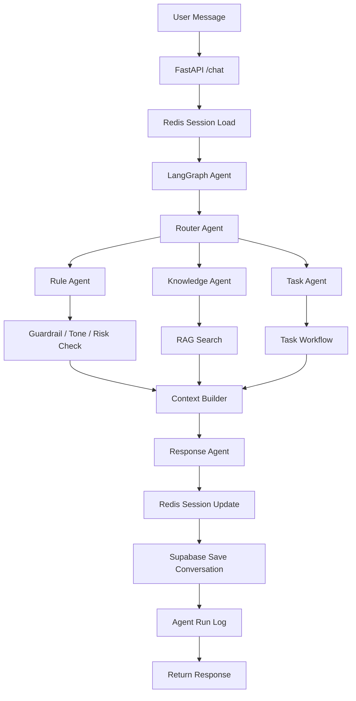
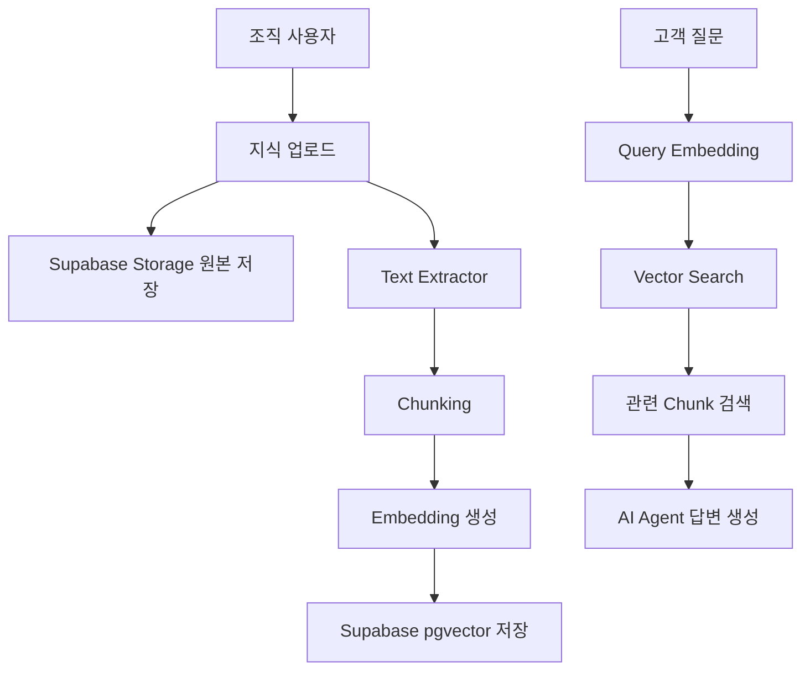
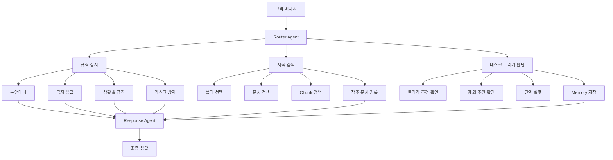
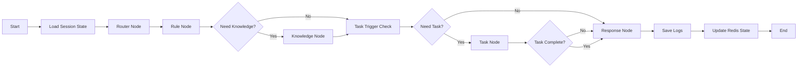

# Front Agent Core 개발 계획서

## 1. 개발 목표

Front Agent의 1단계 개발 목표는 **텍스트 기반 AI Agent Core**를 완성하는 것이다.

초기에는 전화, STT, TTS를 바로 붙이지 않고, 먼저 웹채팅 기반으로 AI가 정상적으로 판단하고 실행할 수 있는 구조를 만든다.

Front Agent의 AI Core는 단순 챗봇이 아니라, 조직별 지식, 규칙, 태스크를 기반으로 고객 문의를 처리하는 **AI Agent 운영 시스템**이다.

```
사용자 메시지
→ FastAPI Chat API
→ Redis Session State 조회
→ LangGraph Agent 실행
→ 규칙 확인
→ 지식 검색
→ 태스크 판단 및 실행
→ 응답 생성
→ Redis 상태 업데이트
→ Supabase 대화 저장
→ 사용자에게 응답 반환
```

---

## 2. 핵심 개념

Front Agent AI Core는 크게 3가지 요소로 구성된다.

```
지식 = AI가 참고하는 자료
규칙 = AI가 반드시 지켜야 하는 안전장치
태스크 = AI가 실제로 실행하는 자동화 업무
```

| 구분   | 의미                            | 예시                                                        |
| ------ | ------------------------------- | ----------------------------------------------------------- |
| 지식   | AI가 참고해서 답변할 자료       | FAQ, 가격표, PDF, 엑셀, 웹사이트, 매뉴얼                    |
| 규칙   | AI가 벗어나면 안 되는 운영 기준 | 거짓말 방지, 프로모션 약속 금지, 톤앤매너, 담당자 연결 조건 |
| 태스크 | AI가 실제로 수행하는 업무       | 예약 생성, 예약 변경, 고객 조회, 알림 발송, 상담원 연결     |

---

## 3. 핵심 개발 범위

1단계에서는 Python 백엔드와 AI Agent 중심으로 개발한다.

```
1. FastAPI 기반 Chat API
2. LangGraph 기반 Agent Workflow
3. 조직별 지식 관리
4. 문서 업로드 및 RAG 인덱싱
5. 조직별 규칙 관리
6. 태스크/액션 실행 구조
7. Redis 기반 세션 상태 관리
8. Supabase 기반 영구 저장
9. Agent 실행 로그
10. API 상태 모니터링
11. Developer API Docs
```

---

## 4. 기술 스택

| 구분                   | 기술                                  |
| ---------------------- | ------------------------------------- |
| Language               | Python                                |
| API Server             | FastAPI                               |
| Agent Workflow         | LangGraph                             |
| LLM                    | OpenAI                                |
| RAG                    | LangChain, Supabase pgvector          |
| Database               | Supabase PostgreSQL                   |
| Vector DB              | Supabase PostgreSQL + pgvector        |
| File Storage           | Supabase Storage                      |
| Session / Lock / Queue | Redis                                 |
| API Docs               | FastAPI Swagger UI                    |
| Monitoring             | API Logs, Agent Tracing, Status Check |

---

## 5. 전체 구조



---

## 6. Organization 기준 설계

Front Agent는 여러 조직이 사용할 수 있는 멀티테넌트 구조로 설계한다.

따라서 모든 주요 데이터는 `organization_id`를 기준으로 관리한다.

```
organization_id
```

는 아래 데이터에 모두 포함된다.

```
지식 문서
지식 폴더
규칙
태스크
태스크 단계
고객
상담
예약
Agent 설정
API 로그
Agent 실행 로그
```

멀티테넌트 AI에서 가장 중요한 점은 한 조직의 지식이 다른 조직의 답변에 섞이지 않도록 하는 것이다.

---

## 7. 지식 Knowledge

### 7.1 지식의 역할

지식은 AI가 고객에게 답변할 때 참고하는 자료이다.

예시:

```
FAQ
가격표
서비스 설명
환불 정책
운영 안내
매장별 안내
고객 서비스 매뉴얼
긴급 대응 가이드
웹사이트 내용
```

지식은 단순히 파일을 쌓아두는 것이 아니라, AI가 검색할 수 있도록 구조화해야 한다.

```
조직 사용자 문서 업로드
→ 원본 파일 저장
→ 텍스트 추출
→ Chunking
→ Embedding 생성
→ pgvector 저장
→ 질문 시 organization_id 기준 검색
→ AI 응답에 반영
```

---

### 7.2 지원할 지식 타입

MVP에서는 아래 항목을 우선 지원한다.

| 자료 타입         | MVP 여부 | 설명                          |
| ----------------- | -------- | ----------------------------- |
| 직접 입력 텍스트  | 필수     | FAQ, 가격표, 안내문 직접 작성 |
| PDF               | 필수     | 매뉴얼, 정책 문서, 안내문     |
| TXT / Markdown    | 필수     | 단순 문서                     |
| Excel / CSV       | 필수     | 가격표, 서비스 목록, 운영표   |
| DOCX              | 선택     | 워드 문서                     |
| 웹사이트 URL      | 2차      | 웹페이지 크롤링               |
| Google Docs       | 2차      | Google API 연동 필요          |
| Google Drive 폴더 | 2차      | OAuth 및 폴더 동기화 필요     |
| Notion            | 2차      | Notion API 연동 필요          |

---

### 7.3 지식 폴더 구조

조직은 지식을 폴더 단위로 관리할 수 있어야 한다.

예시:

```
지식 폴더
├─ 공통 정책
├─ 역삼점
├─ 잠실점
├─ 코엑스점
├─ 멤버십
├─ 긴급 대응
└─ 내부 매뉴얼
```

같은 질문이라도 지점이나 상황에 따라 다른 답변이 필요할 수 있다.

예시:

```
역삼점 영업시간
잠실점 영업시간
코엑스점 영업시간
```

이 경우 AI는 전체 지식을 무작정 검색하는 것이 아니라, 고객의 상황에 맞는 폴더를 선택해서 검색해야 한다.

---

### 7.4 지식 처리 흐름



---

### 7.5 지식 관리 화면

관리자 사이트에서는 지식을 아래처럼 관리한다.

```
Knowledge
├─ 폴더 만들기
├─ 지식 추가
├─ 문서 업로드
├─ 참조 여부 설정
├─ 해결률 확인
├─ 참조 횟수 확인
└─ 오래된 지식 관리
```

표시 항목:

| 항목       | 설명                             |
| ---------- | -------------------------------- |
| 이름       | 지식 문서 또는 폴더 이름         |
| 타입       | PDF, Excel, Document, Website 등 |
| 폴더       | 소속 폴더                        |
| 참조 상태  | 참조중 / 미참조                  |
| 해결률     | 해당 지식 사용 시 상담 해결률    |
| 참조 횟수  | AI가 해당 지식을 참조한 횟수     |
| 업데이트일 | 마지막 수정일                    |

---

## 8. 규칙 Rules

### 8.1 규칙의 역할

규칙은 AI가 반드시 지켜야 하는 운영 기준이다.

지식은 AI가 참고하는 자료이고, 규칙은 AI의 행동을 제한하는 안전장치이다.

규칙의 목적은 다음과 같다.

```
거짓말 방지
잘못된 프로모션 약속 방지
브랜드 톤 유지
리스크 있는 응답 차단
상황별 응답 기준 적용
담당자 연결 조건 정의
```

예시:

```
AI는 문서에 없는 프로모션을 약속하지 않는다.
가격은 등록된 지식에 있는 내용만 안내한다.
환불 가능 여부는 임의로 판단하지 않는다.
고객이 화난 상태이면 담당자 연결을 제안한다.
영업시간 외에는 예약 확정을 하지 않는다.
해외 결제 문의는 별도 안내 규칙을 따른다.
```

---

### 8.2 기본 CX 톤앤매너

조직은 AI 상담사의 기본 톤앤매너를 설정할 수 있어야 한다.

예시:

```
ALF는 친절한 신입 CX 매니저야.
브랜드 관련 내용을 친절하게 안내해줘.
신뢰감을 주면서도 편안한 말투를 사용해.
고객이 질문한 내용만 최대한 간결하게 답변해.
확실하지 않은 내용은 추측하지 말고 담당자 확인이 필요하다고 안내해.
```

Front Agent에서는 이 내용을 `agent_settings`와 `rules`에 나누어 저장한다.

```
agent_settings = 기본 성격, 말투, 언어, 응답 방식
rules = 상황별 제한 조건, 금지 행동, 특정 문의 대응 기준
```

---

### 8.3 규칙 필터

규칙은 모든 상황에 항상 적용되는 것이 아니라, 문의 유형이나 고객 상황에 따라 다르게 적용될 수 있다.

예시 필터:

```
배송 일정 문의
해외 결제 관련 문의
예약 문의
환불 문의
프로모션 문의
불만 고객
VIP 고객
```

규칙은 켜고 끌 수 있어야 하며, 우선순위도 설정할 수 있어야 한다.

---

### 8.4 규칙 구조

```
rules
- id
- organization_id
- name
- description
- rule_type
- trigger_condition
- instruction
- filters
- priority
- is_active
- created_at
- updated_at
```

예시:

```json
{
  "name": "해외 결제 관련 문의",
  "rule_type": "payment",
  "trigger_condition": "고객이 해외 카드, 해외 결제, 해외 승인 실패를 문의할 때",
  "instruction": "해외 결제는 카드사 승인 정책에 따라 실패할 수 있으며, 정확한 사유는 카드사에 확인하도록 안내한다. 임의로 결제 성공 가능성을 약속하지 않는다.",
  "filters": ["해외 결제", "결제 실패"],
  "priority": 10,
  "is_active": true
}
```

---

### 8.5 규칙 적용 원칙

규칙은 RAG 검색 결과보다 우선순위가 높다.

예시:

```
지식 문서에 오래된 프로모션 안내가 남아 있어도,
규칙에 "현재 프로모션은 담당자 확인 후 안내"가 설정되어 있다면
AI는 프로모션을 확정적으로 안내하면 안 된다.
```

따라서 규칙은 단순 문서 검색이 아니라, **Rule Engine + Prompt Guardrail**로 처리한다.

---

## 9. 태스크 Tasks

### 9.1 태스크의 역할

태스크는 AI가 실제로 실행할 수 있는 자동화 업무이다.

지식 기반 응답만으로는 상담을 줄이는 데 한계가 있다.

예를 들어 고객이 예약을 원하면 AI가 단순히 예약 방법만 안내하는 것이 아니라 실제로 예약 가능 시간을 조회하고 예약을 생성해야 한다.

예시 태스크:

```
예약 가능 시간 조회
예약 생성
예약 변경
예약 취소
고객 조회
고객 등록
상담 요약
알림 발송
담당자 연결
주문 취소
환불 접수
배송 조회
```

---

### 9.2 태스크는 단계형 Workflow로 관리

태스크는 단일 함수 호출이 아니라 단계형 플로우로 관리한다.

예시: 예약 생성 태스크

```
Trigger: 예약 의도 감지

Step A. 서비스 종류 확인
Step B. 날짜 확인
Step C. 가능 시간 조회
Step D. 고객 정보 확인
Step E. 예약 생성
Step F. 예약 완료 안내
```

예시: 주문 취소 태스크

```
Trigger: 주문 취소 의도 감지

Step A. 주문 목록 및 배송 현황 조회
Step B. 고객에게 취소할 주문 선택 요청
Step C. 취소 가능 여부 확인
Step D. 취소 접수 API 실행
Step E. 취소 완료 안내
```

---

### 9.3 태스크 트리거

태스크는 고객의 의도가 명확할 때만 실행되어야 한다.

예시:

```
이 태스크는 고객의 목적이 실제 예약을 생성하려는 것일 때만 트리거된다.
단순히 예약 정책이나 가능 여부만 문의하는 경우에는 바로 예약 생성 태스크를 실행하지 않는다.
```

트리거 포함 조건:

```
"예약하고 싶어요"
"내일 2시에 예약 가능해요?"
"방문 예약 잡아주세요"
```

트리거 제외 조건:

```
예약 정책만 묻는 경우
가격만 묻는 경우
영업시간만 묻는 경우
다른 서비스 문의인 경우
```

---

### 9.4 태스크 단계 타입

각 태스크 단계는 아래 타입으로 나눌 수 있다.

| 단계 타입   | 설명                                         |
| ----------- | -------------------------------------------- |
| message     | 고객에게 안내 메시지 전송                    |
| instruction | AI가 고객 응답을 해석하거나 필요한 값을 추출 |
| code        | 외부 API 또는 내부 함수 실행                 |
| condition   | 다음 단계 분기                               |
| complete    | 태스크 완료                                  |

---

### 9.5 태스크 구조

```
tasks
- id
- organization_id
- name
- description
- trigger_prompt
- trigger_include_conditions
- trigger_exclude_conditions
- service_type
- is_active
- created_at
- updated_at
```

```
task_steps
- id
- organization_id
- task_id
- step_order
- step_name
- step_type
- instruction
- code
- next_step_id
- fallback_step_id
- created_at
- updated_at
```

```
task_memories
- id
- organization_id
- session_id
- task_id
- key
- value
- created_at
- updated_at
```

---

### 9.6 태스크 Memory

태스크는 여러 대화에 걸쳐 진행될 수 있으므로 중간 상태를 저장해야 한다.

예시:

```json
{
  "task": "create_appointment",
  "step": "asking_time",
  "service": "상담",
  "date": "2026-06-20",
  "customer_name": "김민수"
}
```

이 정보는 Redis에 저장하고, 완료된 태스크 결과는 Supabase에 저장한다.

---

## 10. 지식 / 규칙 / 태스크 통합 구조



---

## 11. Graph RAG 확장 방향

초기에는 완전한 Graph RAG를 구현하지 않고 아래 구조로 개발한다.

```
Vector RAG
+ Rule Engine
+ Task Workflow
```

하지만 지식, 규칙, 태스크, 고객, 예약, 상담 데이터를 관계형으로 연결하면 Graph RAG 구조로 확장할 수 있다.

Graph RAG 확장 예시:

```
고객 A
→ 지난 상담 내역
→ 선호 서비스
→ 기존 예약
→ 조직 예약 규칙
→ 가능한 시간
→ 예약 생성 태스크
```

발표용 설명:

```
초기에는 Vector RAG 기반 지식 검색을 사용하고,
이후 조직별 지식, 규칙, 태스크, 고객, 예약 데이터를 관계형으로 연결하여
Graph RAG 구조로 확장할 수 있도록 설계한다.
```

---

## 12. 데이터 저장 구조

### 12.1 Supabase Storage

원본 파일 저장용.

```
organizations/{organization_id}/knowledge/{file_name}
```

저장 대상:

```
PDF
Excel
CSV
DOCX
Markdown
TXT
첨부 파일
```

---

### 12.2 Supabase PostgreSQL + pgvector

검색용 텍스트와 벡터 저장용.

```
knowledge_sources
knowledge_chunks
```

`pgvector`는 별도 서비스가 아니라 PostgreSQL 안에 설치되는 확장 기능이다.

즉 벡터는 Supabase PostgreSQL 테이블 안에 저장된다.

```
knowledge_chunks
├─ content
└─ embedding vector(1536)
```

---

### 12.3 Redis

실시간 상태 관리용.

```
Session State
Task Memory
Appointment Hold
Live Events
Queue
Rate Limit
```

---

## 13. 필수 테이블

### organizations

```
id
name
slug
plan
status
created_at
updated_at
```

---

### organization_members

```
id
organization_id
user_id
role
created_at
```

---

### agent_settings

```
id
organization_id
agent_name
tone
language
system_prompt
fallback_message
is_active
created_at
updated_at
```

---

### knowledge_folders

```
id
organization_id
name
description
parent_id
created_at
updated_at
```

---

### knowledge_sources

```
id
organization_id
folder_id
title
source_type
file_url
file_name
mime_type
status
is_referenced
resolution_rate
reference_count
created_at
updated_at
```

---

### knowledge_chunks

```
id
organization_id
source_id
folder_id
chunk_index
content
embedding
metadata
created_at
```

---

### rules

```
id
organization_id
name
description
rule_type
trigger_condition
instruction
filters
priority
is_active
created_at
updated_at
```

---

### tasks

```
id
organization_id
name
description
trigger_prompt
trigger_include_conditions
trigger_exclude_conditions
service_type
is_active
created_at
updated_at
```

---

### task_steps

```
id
organization_id
task_id
step_order
step_name
step_type
instruction
code
next_step_id
fallback_step_id
created_at
updated_at
```

---

### task_memories

```
id
organization_id
session_id
task_id
key
value
created_at
updated_at
```

---

### customers

```
id
organization_id
name
phone
email
memo
created_at
updated_at
```

---

### conversations

```
id
organization_id
session_id
customer_id
channel
status
summary
created_at
updated_at
```

---

### conversation_messages

```
id
organization_id
conversation_id
role
content
metadata
created_at
```

---

### appointments

```
id
organization_id
customer_id
service_name
start_time
end_time
status
memo
created_at
updated_at
```

---

### agent_runs

```
id
organization_id
session_id
intent
used_agents
used_knowledge
applied_rules
executed_tasks
latency_ms
token_usage
status
final_response
created_at
```

---

### api_logs

```
id
organization_id
method
endpoint
status_code
response_time_ms
request_body
response_body
error_message
created_at
```

---

## 14. Redis 사용 범위

Redis는 영구 저장소가 아니라 실시간 상태 관리용 저장소로 사용한다.

| 용도                | 설명                                |
| ------------------- | ----------------------------------- |
| Session State       | 현재 상담 단계 저장                 |
| Task Memory         | 태스크 진행 중 필요한 값 저장       |
| Conversation Memory | 여러 메시지에 걸친 흐름 유지        |
| Appointment Hold    | 예약 시간 임시 점유                 |
| Live Events         | 실시간 상담 모니터링 이벤트         |
| Queue               | 상담 요약, 알림 발송 등 비동기 작업 |
| Rate Limit          | 조직별 API 요청 제한                |

---

## 15. Redis Key 예시

### 대화 세션 상태

```
session:{organization_id}:{session_id}
```

예시:

```
session:org_123:chat_001
```

---

### 태스크 메모리

```
task_memory:{organization_id}:{session_id}:{task_id}
```

---

### 예약 임시 점유

```
appointment_hold:{organization_id}:{datetime}
```

TTL:

```
5분
```

---

### 실시간 상담 이벤트

```
live_events:{organization_id}
```

---

## 16. LangGraph Agent 구성

AI Agent는 처음부터 너무 많이 나누지 않고, 5개 핵심 Agent로 구성한다.

```
Router Agent
Rule Agent
Knowledge Agent
Task Agent
Response Agent
```

---

## 17. Router Agent

Router Agent는 사용자의 메시지를 보고 어떤 흐름으로 처리할지 결정한다.

### 분류 Intent

```
faq
pricing
reservation
customer
handoff
task
general
```

예시:

```
"가격 얼마예요?" → pricing
"내일 예약 가능해요?" → reservation
"영업시간이 어떻게 돼요?" → faq
"상담원 연결해주세요" → handoff
"예약 취소하고 싶어요" → task
```

---

## 18. Rule Agent

Rule Agent는 조직별 규칙을 확인한다.

역할:

```
기본 톤앤매너 적용
금지 응답 확인
프로모션/가격/환불 리스크 체크
상황별 규칙 적용
담당자 연결 조건 확인
```

Rule Agent는 AI가 지식 검색 결과를 잘못 해석하거나, 근거 없는 답변을 하지 않도록 방어한다.

---

## 19. Knowledge Agent

Knowledge Agent는 조직별 지식 문서를 검색한다.

사용 데이터:

```
knowledge_folders
knowledge_sources
knowledge_chunks
Supabase pgvector
OpenAI Embedding
```

처리 흐름:

```
사용자 질문
→ Embedding 생성
→ organization_id 기준 문서 검색
→ folder/context 기준 필터링
→ 관련 chunk 추출
→ Context 생성
```

---

## 20. Task Agent

Task Agent는 고객 요청이 실제 업무 실행으로 이어지는지 판단하고, 필요한 태스크를 실행한다.

처리 흐름:

```
사용자 의도 확인
→ 태스크 트리거 조건 확인
→ 제외 조건 확인
→ 현재 진행 중인 태스크 메모리 확인
→ 다음 단계 실행
→ 결과 저장
```

---

## 21. Response Agent

Response Agent는 최종 응답을 생성한다.

입력 데이터:

```
사용자 메시지
조직별 톤앤매너
적용된 규칙
검색된 지식
태스크 실행 결과
대화 세션 상태
```

출력:

```
사용자에게 보여줄 최종 답변
```

---

## 22. LangGraph State

```python
from typing import TypedDict, List, Dict, Any, Optional

class AgentState(TypedDict):
    organization_id: str
    session_id: str
    user_message: str

    intent: Optional[str]
    session_state: Dict[str, Any]

    active_task_id: Optional[str]
    task_step: Optional[str]
    task_memory: Dict[str, Any]

    knowledge_context: List[Dict[str, Any]]
    selected_folders: List[str]

    rules: List[Dict[str, Any]]
    applied_rules: List[str]

    tool_results: Dict[str, Any]
    executed_tasks: List[str]

    used_agents: List[str]
    used_knowledge: List[str]

    final_response: Optional[str]
    latency_ms: Optional[int]
    token_usage: Optional[Dict[str, Any]]
```

---

## 23. LangGraph 흐름



---

## 24. API 구조

### Chat API

```
POST /chat
```

요청:

```json
{
  "organization_id": "org_123",
  "session_id": "chat_001",
  "message": "내일 예약 가능해요?"
}
```

응답:

```json
{
  "session_id": "chat_001",
  "message": "내일은 오후 2시, 3시, 5시에 예약 가능합니다.",
  "intent": "reservation",
  "used_agents": ["router", "rule", "knowledge", "task", "response"],
  "applied_rules": ["business_hours", "no_same_day_booking"],
  "used_knowledge": ["reservation_policy"],
  "executed_tasks": ["check_available_slots"]
}
```

---

### Knowledge API

```
POST /knowledge/upload
POST /knowledge
GET /knowledge
GET /knowledge/folders
PATCH /knowledge/{id}
DELETE /knowledge/{id}
```

---

### Rules API

```
POST /rules
GET /rules
PATCH /rules/{id}
DELETE /rules/{id}
```

---

### Tasks API

```
POST /tasks
GET /tasks
POST /tasks/{id}/steps
PATCH /tasks/{id}
DELETE /tasks/{id}
```

---

## 25. Status Page

관리자 사이트에서 API, AI Agent, 서버 상태를 확인할 수 있어야 한다.

```
/status
```

확인 항목:

| 항목               | 설명                             |
| ------------------ | -------------------------------- |
| API Server         | FastAPI 서버 상태                |
| Database           | Supabase 연결 상태               |
| Redis              | Redis 연결 상태                  |
| RAG Search         | pgvector 검색 상태               |
| LLM Provider       | OpenAI 연결 상태                 |
| Embedding Provider | 임베딩 생성 상태                 |
| Task Tools         | 예약/고객조회/상담저장 Tool 상태 |
| WebSocket          | 실시간 상담 연결 상태            |

---

## 26. Monitoring API

### Health Check

```
GET /health
```

응답:

```json
{
  "status": "ok",
  "service": "ai-core",
  "timestamp": "2026-06-12T12:00:00Z"
}
```

---

### Status Check

```
GET /status
```

응답:

```json
{
  "api": "healthy",
  "database": "healthy",
  "redis": "healthy",
  "rag": "healthy",
  "llm": "healthy",
  "embedding": "healthy"
}
```

---

### Metrics

```
GET /metrics
```

확인 데이터:

```
API 요청 수
평균 응답속도
에러율
Endpoint별 상태
LLM 응답속도
RAG 검색속도
Tool 실행속도
```

---

### Agent Runs

```
GET /agent-runs?organization_id=org_123
```

응답 예시:

```json
{
  "session_id": "chat_001",
  "intent": "reservation",
  "agents": ["router", "rule", "knowledge", "task", "response"],
  "used_knowledge": ["business_hours", "reservation_policy"],
  "applied_rules": ["no_same_day_booking"],
  "executed_tasks": ["check_available_slots"],
  "latency_ms": 1840,
  "status": "success"
}
```

---

## 27. 관리자 사이트 메뉴

```
Dashboard
├─ AI Test Chat
├─ Knowledge
│  ├─ Folders
│  ├─ Documents
│  ├─ Uploads
│  └─ Reference Stats
├─ Rules
│  ├─ Tone & Manner
│  ├─ Guardrails
│  ├─ Filters
│  └─ Risk Rules
├─ Tasks
│  ├─ Triggers
│  ├─ Steps
│  ├─ Code Actions
│  └─ Task Memory
├─ Conversations
├─ Appointments
├─ Agent Runs
├─ API Monitoring
├─ Status Page
└─ Developer Docs
```

---

## 28. Python 폴더 구조

```
services/ai-core/

app/
├── main.py
│
├── api/
│   ├── chat.py
│   ├── knowledge.py
│   ├── rules.py
│   ├── tasks.py
│   ├── health.py
│   ├── status.py
│   ├── metrics.py
│   └── docs.py
│
├── graph/
│   ├── state.py
│   ├── graph.py
│   └── nodes/
│       ├── load_session_node.py
│       ├── router_node.py
│       ├── rule_node.py
│       ├── knowledge_node.py
│       ├── task_node.py
│       ├── response_node.py
│       ├── save_logs_node.py
│       └── update_session_node.py
│
├── rag/
│   ├── document_loader.py
│   ├── text_extractor.py
│   ├── chunker.py
│   ├── embeddings.py
│   ├── indexer.py
│   └── retriever.py
│
├── rules/
│   ├── rule_engine.py
│   ├── guardrail.py
│   └── filter_matcher.py
│
├── tasks/
│   ├── task_engine.py
│   ├── trigger_matcher.py
│   ├── step_runner.py
│   ├── memory.py
│   └── code_runner.py
│
├── tools/
│   ├── appointment_tools.py
│   ├── customer_tools.py
│   ├── conversation_tools.py
│   └── notification_tools.py
│
├── memory/
│   ├── redis_session.py
│   ├── conversation_memory.py
│   └── live_events.py
│
├── monitoring/
│   ├── api_logger.py
│   ├── agent_tracer.py
│   ├── health_checker.py
│   ├── metrics_collector.py
│   └── status_service.py
│
├── repositories/
│   ├── organization_repo.py
│   ├── knowledge_repo.py
│   ├── rule_repo.py
│   ├── task_repo.py
│   ├── conversation_repo.py
│   ├── appointment_repo.py
│   └── monitoring_repo.py
│
├── providers/
│   ├── openai_provider.py
│   ├── embedding_provider.py
│   └── llm_provider.py
│
└── core/
    ├── config.py
    ├── db.py
    ├── redis.py
    └── logger.py
```

---

## 29. 개발 순서

### Step 1. FastAPI 프로젝트 세팅

```
FastAPI 기본 서버
환경변수 설정
Supabase 연결
Redis 연결
OpenAI 연결
```

---

### Step 2. Chat API 생성

```
POST /chat
```

먼저 Postman에서 테스트 가능해야 한다.

---

### Step 3. LangGraph State 정의

AgentState를 정의하고 LangGraph에서 공유 상태로 사용한다.

---

### Step 4. Redis Session Load 구현

`session_id` 기준으로 이전 대화 상태를 불러온다.

---

### Step 5. Rule Engine 구현

먼저 기본 톤앤매너, 금지 응답, 리스크 방지 규칙을 적용한다.

```
기본 CX 톤앤매너
거짓말 방지 규칙
프로모션 약속 금지
담당자 연결 조건
```

---

### Step 6. Router Node 구현

사용자 메시지의 Intent를 분류한다.

```
faq
pricing
reservation
customer
handoff
task
general
```

---

### Step 7. Knowledge RAG 구현

```
지식 폴더 생성
문서 등록
파일 업로드
Text Extract
Chunking
Embedding
pgvector 저장
Similarity Search
```

---

### Step 8. Task Workflow 구현

처음에는 예약 태스크 1개만 제대로 구현한다.

```
Trigger: 예약 의도 감지

Step A. 서비스 종류 확인
Step B. 날짜 확인
Step C. 가능 시간 조회
Step D. 고객 정보 확인
Step E. 예약 생성
Step F. 예약 완료 안내
```

---

### Step 9. Response Node 구현

규칙 결과, 지식 검색 결과, 태스크 실행 결과를 조합해서 최종 답변을 생성한다.

---

### Step 10. Redis Session / Task Memory Update 구현

현재 상담 단계와 태스크 진행 정보를 Redis에 저장한다.

---

### Step 11. Supabase Conversation 저장

상담 메시지와 최종 응답을 저장한다.

---

### Step 12. Agent Run Log 저장

AI가 어떤 판단을 했는지 저장한다.

```
Intent
Used Agent
Used Knowledge
Applied Rules
Executed Tasks
Latency
Token Usage
Final Response
```

---

### Step 13. Health / Status / Metrics API 구현

```
GET /health
GET /status
GET /metrics
GET /agent-runs
GET /api-logs
```

---

### Step 14. Swagger API 문서 정리

FastAPI 자동 문서를 기준으로 외부 개발자가 볼 수 있는 API Docs를 만든다.

---

## 30. 1단계 완료 기준

1단계 완료 기준은 다음과 같다.

```
1. /chat API로 AI 응답 가능
2. organization_id 기준으로 지식 검색 가능
3. 지식 폴더 생성 가능
4. PDF 또는 CSV 업로드 후 인덱싱 가능
5. organization_id 기준으로 규칙 적용 가능
6. 기본 톤앤매너와 금지 응답 규칙 적용 가능
7. 예약 태스크 Workflow 실행 가능
8. Redis에 세션 상태와 태스크 메모리 저장 가능
9. Supabase에 상담 로그 저장 가능
10. Agent 실행 로그 확인 가능
11. API 응답속도와 에러 로그 확인 가능
12. /status에서 서버 상태 확인 가능
13. /docs에서 API 문서 확인 가능
```

---

## 31. 1단계 이후 확장

1단계가 완료되면 같은 AI Core에 채널만 추가한다.

```
웹채팅
→ AI Agent Core

카카오톡
→ AI Agent Core

전화 STT
→ AI Agent Core
→ TTS

OpenAI Realtime
→ AI Agent Core

WebRTC
→ AI Agent Core
```

즉, 텍스트 챗봇이 완성되면 음성 통화는 아래처럼 확장된다.

```
고객 음성
→ STT
→ 텍스트 변환
→ AI Agent Core
→ 답변 텍스트 생성
→ TTS
→ 음성 응답
```

---

## 32. 최종 요약

Front Agent AI Core의 1단계는 단순 챗봇이 아니라, 조직별 지식, 규칙, 태스크를 기반으로 판단하고 실행하는 AI Agent 시스템이다.

핵심 구조는 다음과 같다.

```
Supabase Storage = 원본 문서 저장
Supabase PostgreSQL = 조직 데이터, 상담, 예약, 규칙, 태스크 저장
Supabase pgvector = 지식 Chunk와 Embedding 저장
Redis = 세션 상태, 태스크 메모리, 실시간 이벤트, 예약 Lock, Queue
LangGraph = AI 판단 흐름
Knowledge = 구조화된 RAG 데이터
Rules = AI 안전장치와 Guardrail
Tasks = 단계형 업무 자동화 Workflow
Monitoring = API 상태와 Agent 판단 과정 추적
Developer Docs = 외부 연동을 위한 API 문서
```

Front Agent의 핵심 차별점은 다음과 같다.

```
AI가 답변만 하는 것이 아니라,
조직별 지식과 규칙 안에서 안전하게 답변하고,
필요하면 태스크를 실행하여 실제 업무까지 처리한다.
```
