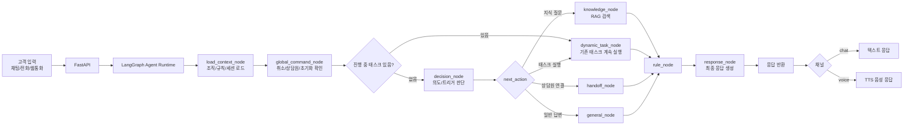
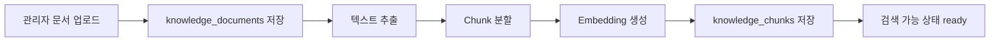
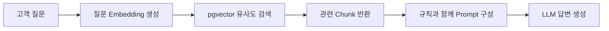
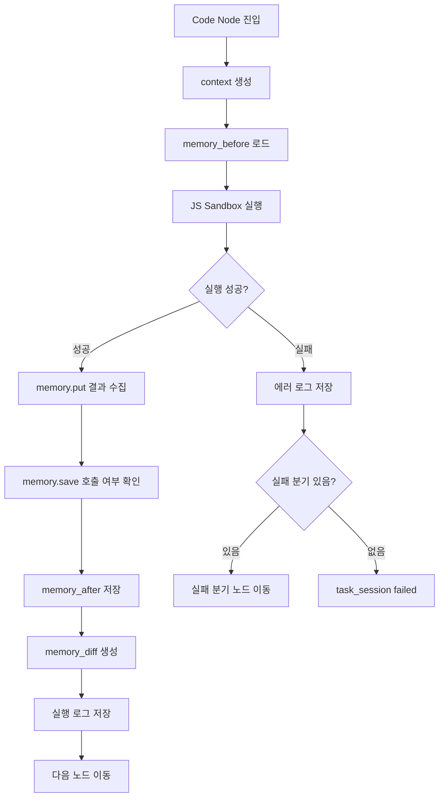
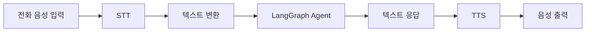

# Front Agent 개발 문서 v2

## AI 상담/업무 자동화 Agent Builder Platform

---

## 1. 프로젝트 개요

Front Agent는 조직이 직접 AI 상담원을 구성할 수 있는 AI Agent Builder 플랫폼이다.

사용자는 관리자 화면에서 조직별 지식, 규칙, 태스크를 직접 설정할 수 있으며, 태스크는 다이어그램 기반 플로우 빌더를 통해 업무 흐름을 구성한다.

Front Agent는 단순 FAQ 챗봇이 아니라 고객 문의를 이해하고, 조직 지식을 검색하며, 규칙을 적용하고, 태스크를 실행하여 실제 업무 처리까지 수행하는 AI 상담/자동화 플랫폼을 목표로 한다.

초기 채널은 웹 채팅을 기준으로 개발하고, 이후 전화, 웹콜(WebRTC)로 확장한다.

---

## 2. 핵심 목표

### 2.1 제품 목표

- 조직별 AI 상담원 생성
- 조직별 지식 업로드 및 관리
- 조직별 응답/업무 규칙 관리
- 태스크 플로우를 다이어그램으로 직접 구성
- 태스크 내 변수/메모리 관리
- JavaScript 기반 Code Node 지원
- 태스크 실행 로그 및 테스트 기능 제공
- 채팅/전화/웹통화에서 동일한 Agent Engine 사용
- 상담원 연결 및 승인 기반 업무 처리 지원

---

## 3. 핵심 개념

### 3.1 Organization

조직은 서비스를 사용하는 하나의 사업체 또는 팀 단위이다.

모든 데이터는 `organization_id` 기준으로 분리된다.

포함 데이터:

```txt id="po8nc6"
- 지식
- 규칙
- 태스크
- 고객 세션
- 대화 기록
- 실행 로그
```

---

### 3.2 Knowledge

조직이 업로드하거나 직접 입력한 정보이다.

예시:

```txt id="t6tpz7"
- 가격표
- 영업시간
- 서비스 설명
- 예약 정책
- 환불 정책
- FAQ
- PDF, DOCX, CSV, XLSX 문서
```

처리 흐름:

```txt id="3j13k8"
문서 업로드
→ 텍스트 추출
→ Chunk 분할
→ Embedding 생성
→ knowledge_chunks 저장
→ 고객 질문 시 vector search
→ LLM 답변 생성
```

---

### 3.3 Rule

AI가 반드시 지켜야 하는 조직별 운영 규칙이다.

예시:

```txt id="bhqt7u"
- 모르면 지어내지 않는다.
- 결제 또는 관리자 승인 전에는 예약 확정이라고 말하지 않는다.
- 가격은 등록된 지식에 있는 내용만 말한다.
- 불만 고객은 상담원에게 연결한다.
- 내부 시스템명을 고객에게 노출하지 않는다.
```

규칙은 관리자 화면에서 생성, 수정, 삭제, 활성/비활성, 우선순위 설정이 가능해야 한다.

---

### 3.4 Task

태스크는 고객 문의를 처리하기 위한 업무 자동화 플로우이다.

예시:

```txt id="qd7v11"
- 예약 생성
- 예약 조회
- 예약 취소
- 환불 요청
- 고객 정보 수집
- 상담원 연결
- 방문 상담 신청
```

태스크는 다음 요소로 구성된다.

```txt id="2kw9em"
Trigger
→ Node
→ Edge
→ Memory
→ End
```

---

### 3.5 Task Flow

하나의 업무 프로세스를 의미한다.

예시:

```txt id="pv0w9l"
예약 생성 플로우
```

구성 예시:

```txt id="uhg1sq"
Trigger: 고객이 예약을 원함
→ Instruction: 예약 정보 추출
→ Ask: 날짜 질문
→ Ask: 시간 질문
→ Code: 날짜/시간 정규화
→ Function: 예약 가능 여부 확인
→ Condition: 가능 여부 분기
→ DB Insert: 예약 요청 저장
→ End: 접수 완료
```

---

### 3.6 Task Node

태스크 다이어그램의 각 단계이다.

지원 노드 타입:

| 노드 타입          | 설명                         |
| ------------------ | ---------------------------- |
| Trigger            | 태스크 시작 조건             |
| Message            | 고객에게 메시지 출력         |
| Ask                | 질문 후 답변을 메모리에 저장 |
| Instruction        | LLM에게 추출/판단/요약 지시  |
| Knowledge Search   | 조직 지식 검색               |
| Code               | JavaScript 코드 실행         |
| Function           | 미리 정의된 함수/API 실행    |
| API Call           | 외부 API 호출                |
| DB Query           | DB 조회                      |
| DB Insert / Update | DB 저장/수정                 |
| Condition          | 메모리/변수 기준 분기        |
| Human Approval     | 상담사 승인 대기             |
| Handoff            | 상담원 연결                  |
| End                | 태스크 종료                  |

---

## 4. 전체 시스템 구조



---

## 5. LangGraph / LangChain 사용 기준

### 5.1 LangGraph 역할

LangGraph는 전체 Agent 실행 흐름을 관리한다.

역할:

```txt id="8bw15h"
- 대화 상태 관리
- 진행 중 태스크 우선 처리
- decision 분기
- 지식 검색 분기
- 태스크 실행 분기
- 상담원 연결 분기
- 규칙 적용
- 최종 응답 생성
```

### 5.2 LangChain 역할

LangChain은 필요한 기능만 부분적으로 사용한다.

사용 영역:

```txt id="6pm15b"
- ChatOpenAI
- PromptTemplate
- OutputParser
- OpenAIEmbeddings
- TextSplitter
- Retriever
```

### 5.3 핵심 원칙

```txt id="fb8f31"
LangGraph = 실행 흐름과 상태 관리
LangChain = LLM/RAG 도구
FastAPI = API 서버
Supabase/Postgres = 영구 데이터 저장
pgvector = 지식 검색
Redis = 세션/큐/실시간 상태
Dynamic Task Runner = 사용자 정의 태스크 실행
```

---

## 6. 태스크 실행 원칙

### 6.1 기본 원칙

한 번 태스크에 진입하면 태스크가 종료되기 전까지 고객의 다음 메시지는 기본적으로 현재 태스크의 입력으로 처리한다.

```txt id="ufwyaa"
태스크 진입
→ task_session 생성
→ 현재 노드 실행
→ 사용자 응답 대기
→ 응답을 memory에 저장
→ 다음 노드 이동
→ 조건 분기 또는 단일 이동
→ End 노드 도달
→ 태스크 종료
```

---

### 6.2 진행 중 태스크 우선순위

```txt id="8gm2ws"
1. 진행 중인 task_session 확인
2. 있으면 현재 태스크 계속 실행
3. 없으면 decision_node에서 새 트리거 판단
4. 트리거 충족 시 새 태스크 시작
5. 아니면 지식 검색 또는 일반 답변
```

---

### 6.3 예외 처리

진행 중 태스크가 있어도 다음 명령은 전역 명령으로 우선 처리한다.

```txt id="ham1at"
- 취소할게요
- 처음부터 다시 할게요
- 상담원 연결해줘
- 그만할게요
- 다른 질문 할게요
```

처리 흐름:

```txt id="5jppq0"
global_command_node
→ 취소/초기화/상담원 연결 여부 판단
→ 필요 시 기존 task_session 중단
```

---

### 6.4 태스크 종료 상태

| 상태             | 설명               |
| ---------------- | ------------------ |
| completed        | 정상 완료          |
| cancelled        | 고객 요청으로 취소 |
| handoff          | 상담원 연결        |
| failed           | 에러 발생          |
| expired          | 세션 만료          |
| approval_waiting | 상담사 승인 대기   |

---

## 7. Task Memory 설계

### 7.1 Memory 개념

Memory는 태스크 실행 중 노드 간 데이터를 저장하고 전달하는 임시 저장소이다.

예시:

```json id="y7zga4"
{
  "customer_name": "김민수",
  "reservation_date": "내일",
  "reservation_time": "오후 3시",
  "normalized_date": "2026-06-22",
  "normalized_time": "15:00",
  "is_available": true
}
```

---

### 7.2 저장 위치

채널톡의 memory 개념은 Front Agent에서 다음 필드로 구현한다.

```txt id="q28g86"
task_sessions.variables = Task Memory
```

---

### 7.3 Memory 사용 위치

Memory에 저장된 값은 다음 노드에서 사용할 수 있다.

```txt id="vcix57"
- Message Node
- Instruction Node
- Condition Node
- Code Node
- Function Node
- API Call Node
- DB Insert / Update Node
```

---

### 7.4 변수 호출 방식

Message Node:

```txt id="j4kouj"
{{memory.customer_name}}님, {{memory.normalized_date}} {{memory.normalized_time}} 예약 가능 여부를 확인해드릴게요.
```

Instruction Node:

```txt id="23ui2w"
아래 메모리를 참고해서 고객에게 예약 가능 여부를 설명해라.

고객명: {{memory.customer_name}}
예약일: {{memory.normalized_date}}
예약시간: {{memory.normalized_time}}
예약 가능 여부: {{memory.is_available}}
```

Condition Node:

```json id="23selv"
{
  "variable": "memory.is_available",
  "operator": "equals",
  "value": true
}
```

---

## 8. Code Node 설계

### 8.1 Code Node 개요

Code Node는 태스크 중간에서 JavaScript 코드를 실행하는 노드이다.

역할:

```txt id="v7mfz6"
- 이전 노드에서 수집한 값 검증
- Memory 값 읽기/쓰기
- 데이터 정규화
- 조건 판단용 값 생성
- 외부 API 조회/갱신
- 내부 시스템과 통신
- 다음 노드에서 사용할 값 저장
```

---

### 8.2 Code Node 실행 환경

Code Node는 다음 객체를 제공한다.

```txt id="v3acfs"
context
memory
isSandbox
```

---

### 8.3 context

`context`는 실행 시점의 읽기 전용 정보이다.

포함 정보:

```txt id="ldnhxj"
- organization
- user
- userChat
- channel
- currentMessage
- task
- node
```

예시:

```json id="h0dvqb"
{
  "organization": {
    "id": "org_123",
    "name": "테스트 병원"
  },
  "user": {
    "id": "customer_123",
    "name": "김민수",
    "phone": "010-1234-5678"
  },
  "userChat": {
    "id": "chat_123",
    "sessionId": "session_123",
    "channel": "chat"
  },
  "currentMessage": {
    "text": "내일 오후 3시에 예약하고 싶어요"
  }
}
```

원칙:

```txt id="zjserj"
context는 읽기 전용이다.
context 값을 수정해도 실제 DB나 세션에는 반영되지 않는다.
```

---

### 8.4 memory

`memory`는 태스크 노드 간 데이터를 저장하는 인터페이스이다.

제공 메서드:

```ts id="iou9kc"
memory.get(key: string): any
memory.put(key: string, value: any): void
memory.save(): Promise<void>
```

원칙:

```txt id="k7e5zi"
memory.get() = 기존 값 읽기
memory.put() = 변경 예정 값 등록
memory.save() = 변경 내용 저장
```

중요:

```txt id="i697iq"
memory.put()만 호출하면 실제 저장되지 않는다.
반드시 await memory.save()를 호출해야 task_sessions.variables에 반영된다.
```

---

### 8.5 isSandbox

`isSandbox`는 테스트 실행 여부를 나타낸다.

```txt id="xzmxbe"
isSandbox = true
- 관리자 테스트 실행
- 외부 API 호출 차단 또는 mock 권장
- 실제 고객/DB에 영향 없음

isSandbox = false
- 실제 고객 상담 실행
- 허용된 API 호출 가능
- 실제 task_session memory 저장
```

---

### 8.6 Code Node 기본 코드 형태

```js id="bb05xg"
async function main({ context, memory, isSandbox }) {
  const name = context.user.name;
  const date = memory.get("reservation_date");

  memory.put("customer_name", name);
  memory.put("checked_date", date);

  await memory.save();

  return {
    ok: true,
  };
}
```

---

### 8.7 예약 정보 정규화 예시

```js id="ej0ngm"
async function main({ context, memory, isSandbox }) {
  const rawDate = memory.get("reservation_date");
  const rawTime = memory.get("reservation_time");

  memory.put("reservation_date_raw", rawDate);
  memory.put("reservation_time_raw", rawTime);

  memory.put("normalized_date", "2026-06-22");
  memory.put("normalized_time", "15:00");

  await memory.save();

  return {
    normalized_date: "2026-06-22",
    normalized_time: "15:00",
  };
}
```

---

### 8.8 API 호출 예시

```js id="p5y7gy"
async function main({ context, memory, isSandbox }) {
  const axios = require("axios");

  const date = memory.get("normalized_date");
  const time = memory.get("normalized_time");

  if (isSandbox) {
    memory.put("availability_result", {
      available: true,
      source: "mock",
    });
    memory.put("is_available", true);

    await memory.save();
    return;
  }

  const response = await axios.post(
    "https://api.example.com/reservations/check",
    {
      date,
      time,
      customerId: context.user.id,
    },
  );

  memory.put("availability_result", response.data);
  memory.put("is_available", response.data.available);

  await memory.save();

  return {
    available: response.data.available,
  };
}
```

---

### 8.9 Code Node 보안 원칙

Code Node는 반드시 격리된 Sandbox에서 실행해야 한다.

필수 제한:

```txt id="fexhxv"
- 서버에서 직접 eval 금지
- 파일 시스템 접근 금지
- 환경변수 직접 접근 금지
- process 접근 금지
- 무한루프 방지
- 실행 시간 제한
- 메모리 사용량 제한
- 허용된 라이브러리만 사용
- 로그 수집
- 실행 결과 검증
- 조직별 실행 권한 분리
```

---

### 8.10 Code Node 실행 제한

초기 설정:

```txt id="bdhkmb"
- language: javascript
- timeout_seconds: 10
- max_memory_mb: 128
- allowed_libraries: axios
- sandbox_network_enabled: false
- production_network_enabled: true
```

향후 고급 설정:

```txt id="o9viwf"
- 허용 도메인 allowlist
- secrets 주입
- API 호출 제한
- 실행 횟수 rate limit
- console.log 저장
- memory diff 표시
```

---

## 9. Function Node와 Code Node 차이

| 구분         | Code Node                    | Function Node                     |
| ------------ | ---------------------------- | --------------------------------- |
| 사용 방식    | JS 직접 작성                 | 미리 정의된 함수 선택             |
| 유연성       | 높음                         | 중간                              |
| 안정성       | 낮음, sandbox 필요           | 높음                              |
| 추천 용도    | 데이터 가공, 커스텀 API 처리 | 예약 생성, 고객 조회 등 표준 기능 |
| MVP 우선순위 | 2차                          | 1차                               |

---

### 9.1 Function Node 예시

```json id="72i9r0"
{
  "node_type": "function",
  "label": "예약 가능 여부 확인",
  "config": {
    "function_name": "check_reservation_availability",
    "params": {
      "date": "{{memory.normalized_date}}",
      "time": "{{memory.normalized_time}}"
    },
    "save_as": "availability_result"
  }
}
```

---

## 10. Code Node 테스트/디버깅

### 10.1 테스트 기능

관리자는 Code Node를 저장하기 전에 테스트할 수 있어야 한다.

테스트 입력:

```txt id="59xqzl"
- sample context
- sample memory
- isSandbox = true
```

테스트 결과:

```txt id="et0bco"
- 실행 성공/실패
- 실행 시간
- console.log
- Memory In
- Memory Out
- Memory Diff
- Error Stack
```

---

### 10.2 테스트 UI 구성

```txt id="93wv43"
Code Node 설정 화면

왼쪽:
- 코드 에디터

오른쪽:
- context JSON
- memory JSON
- isSandbox 설정

하단:
- 실행 버튼
- Result In
- Result Out
- Diff
- Console Log
- Error
```

---

### 10.3 실행 로그 저장

Code Node 실행 결과는 로그로 저장한다.

```sql id="sjmcf7"
create table task_node_execution_logs (
  id uuid primary key default gen_random_uuid(),

  organization_id uuid not null,
  task_session_id uuid,
  flow_id uuid,
  node_id uuid,

  node_type text not null,
  status text not null,

  input_snapshot jsonb,
  output_snapshot jsonb,
  memory_before jsonb,
  memory_after jsonb,
  memory_diff jsonb,

  console_logs jsonb default '[]'::jsonb,
  error jsonb,

  duration_ms int,
  is_sandbox boolean default false,

  created_at timestamptz default now()
);
```

---

## 11. 지식 처리 구조

### 11.1 지식 업로드 흐름



---

### 11.2 검색 흐름



---

## 12. 주요 DB 설계

### 12.1 organizations

```sql id="2d07yl"
create table organizations (
  id uuid primary key default gen_random_uuid(),
  name text not null,
  created_at timestamptz default now()
);
```

---

### 12.2 knowledge_documents

```sql id="fuwsno"
create table knowledge_documents (
  id uuid primary key default gen_random_uuid(),
  organization_id uuid references organizations(id) on delete cascade,
  title text not null,
  file_url text,
  file_type text,
  status text default 'pending',
  created_at timestamptz default now(),
  updated_at timestamptz default now()
);
```

---

### 12.3 knowledge_chunks

```sql id="vumior"
create extension if not exists vector;

create table knowledge_chunks (
  id uuid primary key default gen_random_uuid(),
  organization_id uuid references organizations(id) on delete cascade,
  document_id uuid references knowledge_documents(id) on delete cascade,
  content text not null,
  metadata jsonb default '{}'::jsonb,
  embedding vector(1536),
  created_at timestamptz default now(),
  updated_at timestamptz default now()
);
```

---

### 12.4 rules

```sql id="ylmfia"
create table rules (
  id uuid primary key default gen_random_uuid(),
  organization_id uuid references organizations(id) on delete cascade,
  name text not null,
  description text,
  content text not null,
  rule_type text not null default 'response',
  priority int default 100,
  is_enabled boolean default true,
  created_at timestamptz default now(),
  updated_at timestamptz default now()
);
```

---

### 12.5 task_flows

```sql id="efabqj"
create table task_flows (
  id uuid primary key default gen_random_uuid(),
  organization_id uuid references organizations(id) on delete cascade,
  name text not null,
  description text,
  trigger_intent text,
  trigger_description text,
  trigger_examples jsonb default '[]'::jsonb,
  allowed_channels jsonb default '["chat", "voice"]'::jsonb,
  filters jsonb default '{}'::jsonb,
  is_enabled boolean default true,
  created_at timestamptz default now(),
  updated_at timestamptz default now()
);
```

---

### 12.6 task_nodes

```sql id="6n37l9"
create table task_nodes (
  id uuid primary key default gen_random_uuid(),
  flow_id uuid references task_flows(id) on delete cascade,

  node_key text not null,
  node_type text not null,
  label text not null,

  config jsonb default '{}'::jsonb,
  code text,

  position_x int default 0,
  position_y int default 0,

  timeout_seconds int default 10,
  retry_limit int default 0,

  created_at timestamptz default now(),
  updated_at timestamptz default now(),

  unique(flow_id, node_key)
);
```

---

### 12.7 task_edges

```sql id="c95l4x"
create table task_edges (
  id uuid primary key default gen_random_uuid(),
  flow_id uuid references task_flows(id) on delete cascade,

  source_node_key text not null,
  target_node_key text not null,

  edge_type text default 'single',
  condition_type text default 'always',
  condition_config jsonb default '{}'::jsonb,
  is_failure_edge boolean default false,

  created_at timestamptz default now()
);
```

---

### 12.8 task_sessions

```sql id="lgms7d"
create table task_sessions (
  id uuid primary key default gen_random_uuid(),

  organization_id uuid references organizations(id) on delete cascade,
  session_id text not null,
  flow_id uuid references task_flows(id) on delete cascade,

  current_node_key text not null,
  waiting_node_key text,

  variables jsonb default '{}'::jsonb,

  status text default 'running',
  approval_status text,
  last_error jsonb,
  expires_at timestamptz,

  created_at timestamptz default now(),
  updated_at timestamptz default now(),

  unique(organization_id, session_id, flow_id)
);
```

---

## 13. Backend 구조

```txt id="5cwbgw"
app/
  graph/
    state.py
    graph.py
    nodes/
      load_context_node.py
      global_command_node.py
      decision_node.py
      knowledge_node.py
      dynamic_task_node.py
      rule_node.py
      response_node.py
      handoff_node.py
      general_node.py

  services/
    llm_service.py
    embedding_service.py
    chunk_service.py
    document_parse_service.py
    knowledge_ingest_service.py
    rag_service.py
    rule_service.py

    task_flow_service.py
    dynamic_task_runner.py
    task_node_executors.py
    condition_service.py
    template_service.py

    code_runtime_service.py
    memory_service.py
    code_log_service.py

    reservation_service.py
    customer_service.py
    notification_service.py

  api/
    chat_routes.py
    voice_routes.py
    knowledge_routes.py
    rule_routes.py
    task_flow_routes.py
    task_session_routes.py
    code_test_routes.py
```

---

## 14. AgentState 설계

```python id="5uap4d"
from typing import TypedDict, Literal, Optional, Any


class AgentState(TypedDict, total=False):
    organization_id: str
    session_id: str
    user_message: str
    channel: Literal["chat", "voice", "web_call"]

    rules: list[dict]
    organization_context: dict

    has_running_task: bool
    task_session: Optional[dict]

    intent: str
    next_action: str
    task_type: str
    flow_id: Optional[str]

    knowledge_results: list[dict]

    task_result: Optional[dict]
    task_variables: dict[str, Any]

    response: str
    error: Optional[str]
```

---

## 15. LangGraph Node 구성

### 15.1 load_context_node

역할:

```txt id="19h740"
- 조직 정보 로드
- 활성화된 규칙 로드
- 진행 중 task_session 조회
- 활성화된 task_flow 목록 조회
```

---

### 15.2 global_command_node

역할:

```txt id="v7ipbl"
- 취소
- 처음부터 다시
- 상담원 연결
- 태스크 중단
- 태스크 재시작
```

---

### 15.3 decision_node

역할:

```txt id="byhrcn"
- 진행 중 태스크가 없을 때 실행
- 고객 메시지 의도 판단
- 지식 검색, 태스크 실행, 상담원 연결, 일반 답변 중 선택
- 활성화된 task_flow 중 실행할 flow 선택
```

출력 예시:

```json id="t1ksds"
{
  "next_action": "run_task",
  "flow_id": "uuid",
  "intent": "reservation_create",
  "confidence": 0.87
}
```

---

### 15.4 dynamic_task_node

역할:

```txt id="o28qxu"
- 진행 중 태스크가 있으면 이어서 실행
- 진행 중 태스크가 없으면 새 task_session 생성
- task_nodes/task_edges 로드
- 현재 노드 실행
- memory 업데이트
- 다음 노드 이동
- 대기/완료/실패 상태 저장
```

---

## 16. Dynamic Task Runner 실행 로직

```txt id="f0gm5d"
1. 고객 메시지 수신
2. organization_id, session_id 기준으로 진행 중 task_session 조회
3. 진행 중 세션이 있으면 현재 노드에 사용자 입력 전달
4. 진행 중 세션이 없으면 decision_node에서 flow_id 선택
5. flow_id 기준으로 task_flow, task_nodes, task_edges 로드
6. task_session 생성
7. 현재 노드 실행
8. 노드 타입에 따라 처리
   - message: 메시지 생성 후 다음 노드 이동
   - ask: 질문 출력 후 waiting_user_input
   - instruction: LLM 추출/판단 후 memory 저장
   - code: JS sandbox 실행 후 memory 저장
   - function: 내부 함수 실행 후 결과 저장
   - condition: 조건에 맞는 edge 선택
   - human_approval: 승인 대기 상태 저장
   - end: task_session 완료 처리
9. 대기 또는 완료 상태 반환
```

---

## 17. Code Node 실행 흐름



---

## 18. 관리자 화면 요구사항

### 18.1 지식 관리

```txt id="zzhyqd"
- 문서 업로드
- 직접 텍스트 입력
- 문서 목록 조회
- 문서 수정
- 문서 삭제
- 재임베딩
- 검색 테스트
```

---

### 18.2 규칙 관리

```txt id="q8b187"
- 규칙 생성
- 규칙 수정
- 규칙 삭제
- 활성/비활성
- 우선순위 설정
- 규칙 테스트
```

---

### 18.3 태스크 관리

```txt id="qpjtjn"
- 태스크 목록
- 태스크 생성
- 트리거 설정
- React Flow 기반 노드 편집
- 노드별 Config 설정
- 조건 분기 설정
- Code Node 작성
- Code Node 테스트
- 실행 로그 확인
- 배포/비활성화
```

---

### 18.4 Code Node 편집 화면

```txt id="kqou9l"
왼쪽:
- JavaScript 코드 에디터

오른쪽:
- context sample JSON
- memory sample JSON
- isSandbox 설정

하단:
- 테스트 실행 버튼
- Result In
- Result Out
- Memory Diff
- Console Log
- Error Stack
```

---

## 19. API 설계 초안

### 19.1 Chat API

```http id="ey2oi8"
POST /chat
```

Request:

```json id="61a2yr"
{
  "organization_id": "uuid",
  "session_id": "user-session-id",
  "message": "예약하고 싶어요",
  "channel": "chat"
}
```

Response:

```json id="kx6j7x"
{
  "response": "원하시는 예약 날짜가 언제인가요?",
  "next_action": "run_task",
  "flow_id": "uuid",
  "task_session_status": "waiting_user_input"
}
```

---

### 19.2 Code Test API

```http id="zhk0da"
POST /task-flows/{flow_id}/nodes/{node_id}/test-code
```

Request:

```json id="if82w0"
{
  "context": {
    "user": {
      "id": "customer_123",
      "name": "김민수"
    },
    "userChat": {
      "id": "chat_123",
      "channel": "chat"
    },
    "currentMessage": {
      "text": "내일 오후 3시에 예약하고 싶어요"
    }
  },
  "memory": {
    "reservation_date": "내일",
    "reservation_time": "오후 3시"
  },
  "isSandbox": true
}
```

Response:

```json id="q3n2gm"
{
  "status": "success",
  "duration_ms": 123,
  "memory_before": {
    "reservation_date": "내일",
    "reservation_time": "오후 3시"
  },
  "memory_after": {
    "reservation_date": "내일",
    "reservation_time": "오후 3시",
    "normalized_date": "2026-06-22",
    "normalized_time": "15:00"
  },
  "memory_diff": {
    "added": {
      "normalized_date": "2026-06-22",
      "normalized_time": "15:00"
    },
    "changed": {},
    "removed": {}
  },
  "console_logs": [],
  "error": null
}
```

---

## 20. 음성 채널 확장 구조

음성 채널은 별도 Agent를 만들지 않고 동일한 LangGraph Agent Engine을 사용한다.



음성 채널 고려사항:

```txt id="e3w8g5"
- 응답은 짧고 명확해야 함
- 긴 지식 답변은 요약 필요
- 고객이 말을 끊을 수 있음
- WebSocket/Streaming 필요
- call_id를 session_id로 사용 가능
- 상담원 연결 시 통화 전환 또는 알림 처리 필요
```

---

## 21. MVP 개발 범위

### 21.1 1차 MVP

목표: 웹 채팅 기반 기본 Agent Builder

포함 기능:

```txt id="opdblg"
- 조직 생성
- 지식 텍스트 등록
- 문서 Chunk 분할
- Embedding 생성
- pgvector 검색
- 규칙 CRUD
- LangGraph 기본 실행
- decision_node
- knowledge_node
- response_node
- task_flow DB 구조
- 예약 생성 플로우 수동 등록
- dynamic_task_runner 기본 실행
- ask/message/condition/function/end 노드 지원
```

---

### 21.2 2차 MVP

목표: 태스크 커스텀 기능 강화

포함 기능:

```txt id="nhs7zo"
- React Flow 기반 태스크 빌더
- 노드 추가/삭제/수정
- Edge 연결
- Trigger 설정
- Code Node 추가
- JS Sandbox 실행
- memory.get/put/save
- isSandbox 테스트
- 실행 로그 확인
- Memory Diff 표시
```

---

### 21.3 3차 MVP

목표: 음성/실시간 확장

포함 기능:

```txt id="6m805d"
- WebSocket 채팅
- Streaming 응답
- STT/TTS 연결
- 전화/WebRTC 연결
- 상담원 실시간 모니터링
- 진행 중 대화방 관리
- 상담원 개입 기능
```

---

## 22. 개발 우선순위

```txt id="ihclm6"
1. DB 스키마 확정
2. LangGraph 기본 구조 구현
3. 지식 등록 + Embedding + RAG 검색 구현
4. 규칙 CRUD + 응답 Prompt 주입
5. task_flows/nodes/edges/sessions 구현
6. 예약 생성 플로우를 DB에 수동 등록
7. dynamic_task_runner 구현
8. Function Node 구현
9. 웹 채팅에서 태스크 진행 테스트
10. React Flow 빌더 구현
11. Code Node Sandbox 구현
12. Code Node 테스트/로그 구현
13. 음성 채널 확장
```

---

## 23. 핵심 설계 결정

### 23.1 LangGraph는 고정 실행 엔진

사용자가 태스크를 만들 때마다 LangGraph를 새로 compile하지 않는다.

```txt id="2u8lis"
LangGraph = 고정 실행 엔진
Task Flow = DB 기반 동적 실행
```

---

### 23.2 태스크는 완료 전까지 상태 유지

진행 중인 task_session이 있으면 고객의 다음 메시지는 기본적으로 해당 태스크의 현재 노드 입력으로 처리한다.

---

### 23.3 Memory는 태스크 내 임시 저장소

```txt id="o99p2f"
task_sessions.variables = task memory
```

Code Node, Instruction Node, Condition Node, Message Node가 동일한 memory를 공유한다.

---

### 23.4 context는 읽기 전용

Code Node에서 context를 수정해도 실제 조직/고객/세션 데이터에는 반영되지 않는다.

---

### 23.5 memory는 save해야 저장

```txt id="ppe95r"
memory.put() = 변경 예정
memory.save() = 실제 저장
```

---

### 23.6 Code Node는 반드시 Sandbox

사용자가 작성한 JavaScript는 서버에서 직접 실행하지 않는다.
별도 격리 환경에서 timeout, memory limit, network policy를 적용해 실행한다.

---

### 23.7 Function Node를 먼저 제공

MVP에서는 보안과 안정성을 위해 Function Node를 먼저 구현하고, Code Node는 2차 MVP에서 제공한다.

---

### 23.8 음성은 Agent 앞뒤에 붙인다

```txt id="v1b5fb"
Voice → STT → Text → LangGraph → Text → TTS → Voice
```

---

## 24. 최종 요약

Front Agent는 조직별 AI 상담원을 만들 수 있는 Agent Builder 플랫폼이다.

핵심 구성:

```txt id="8n4lit"
지식 = 조직이 업로드하는 문서/정보
규칙 = AI가 반드시 지켜야 하는 운영 정책
태스크 = 사용자가 다이어그램으로 만드는 업무 자동화 플로우
메모리 = 태스크 내 노드 간 데이터 저장소
코드 노드 = JavaScript로 메모리/API/조건 처리
LangGraph = 전체 실행 엔진
Dynamic Task Runner = DB에 저장된 태스크 플로우 실행기
```

고객 요청 처리 흐름:

```txt id="o52y06"
고객 입력
→ 진행 중 태스크 확인
→ 없으면 트리거/의도 판단
→ 지식 검색 또는 태스크 실행
→ 태스크 내 memory 업데이트
→ 규칙 적용
→ 최종 응답
→ 태스크 완료 전까지 상태 유지
```

이 구조를 통해 Front Agent는 단순 챗봇이 아니라 조직별로 지식, 규칙, 태스크, 코드 실행까지 커스텀 가능한 AI 상담 및 업무 자동화 플랫폼으로 확장된다.
