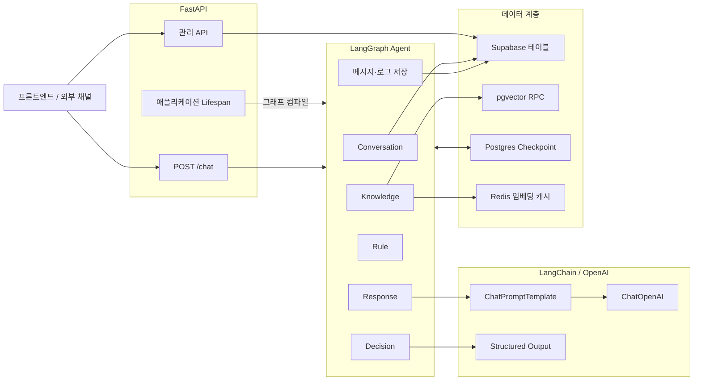
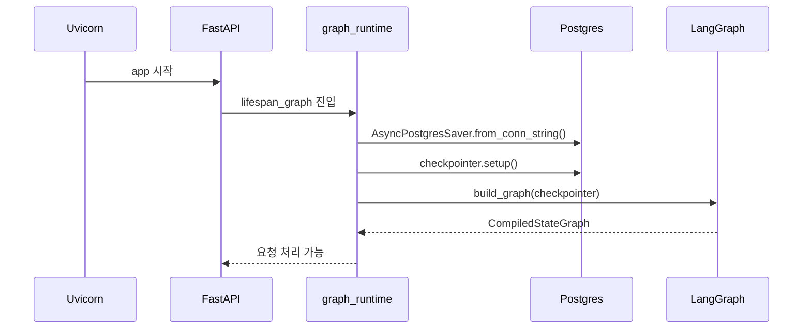
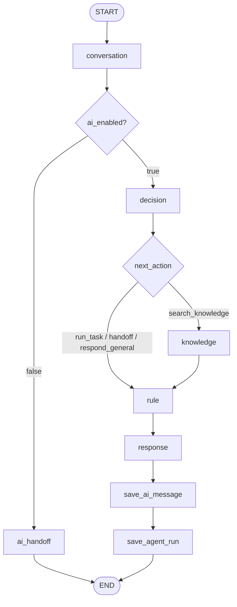
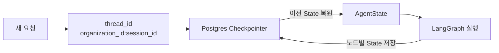
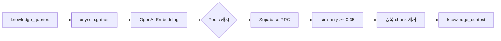
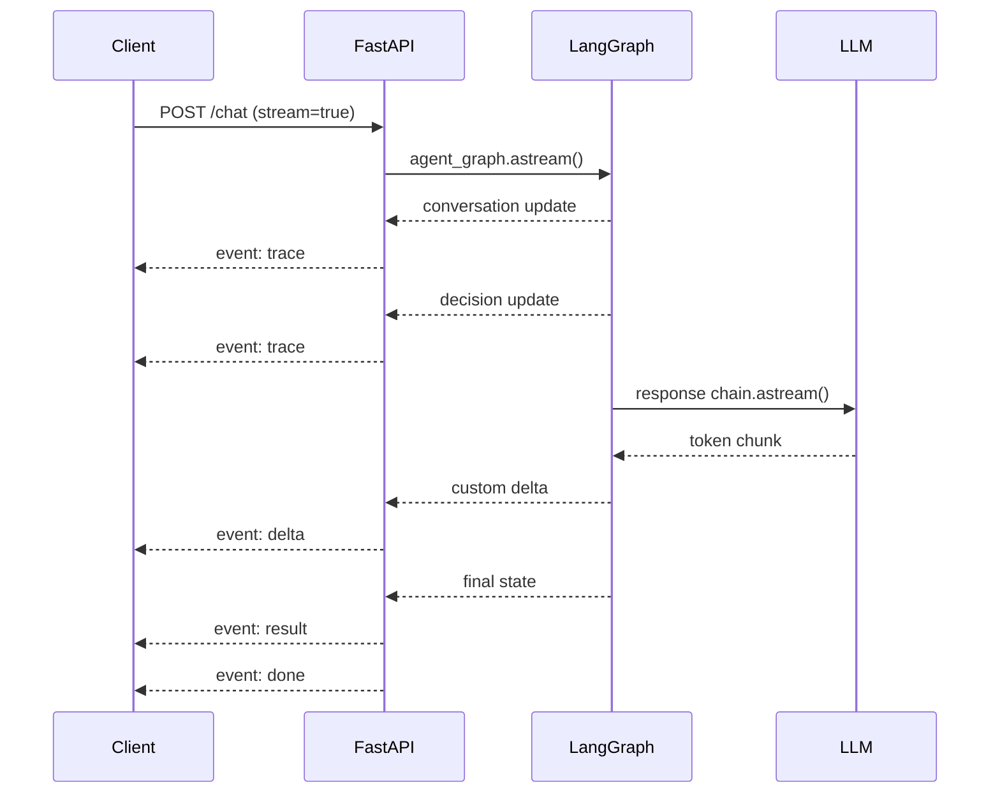

# Front Agent 백엔드 아키텍처

이 문서는 Front Agent 백엔드에 처음 참여하는 팀원이 전체 구조와 요청 처리 흐름을 빠르게 이해할 수 있도록 작성되었습니다.

문서 기준은 현재 `app/` 구현입니다. 설계 초안이 아니라 실제 실행 코드에서 사용하는 LangGraph·LangChain 클래스와 메서드를 기준으로 설명합니다.

## 1. 시스템의 역할

백엔드는 다음 기능을 담당합니다.

- 웹, 전화, 웹콜 채널에서 전달된 텍스트 요청 처리
- LangGraph 기반 AI 상담 워크플로우 실행
- 조직별 LLM 제공자와 모델 설정 적용
- 대화 의도 및 다음 행동 분류
- 조직별 지식 검색(RAG)
- 활성 응답 규칙을 최종 프롬프트에 반영
- SSE 기반 실시간 답변 스트리밍
- 상담 메시지, 실행 로그, 멀티턴 상태 저장
- 규칙, 지식, 상담방 관리 API 제공

## 2. 주요 기술

| 영역 | 기술 | 현재 버전 | 역할 |
|---|---|---:|---|
| API | FastAPI | 0.136.3 | HTTP API와 SSE 응답 |
| 워크플로우 | LangGraph | 1.2.5 | AI 처리 순서, 분기, 상태 관리 |
| LLM 체인 | LangChain Core | 1.4.7 | 프롬프트, 메시지, LCEL 체인 |
| LLM 연동 | langchain-openai | 1.3.2 | `ChatOpenAI` 모델 호출 |
| 상태 저장 | LangGraph Postgres Checkpointer | 3.1.0 | 멀티턴 대화 상태 영속화 |
| 업무 데이터 | Supabase | 2.31.0 | 조직, 대화, 규칙, 지식, 로그 저장 |
| 벡터 검색 | PostgreSQL + pgvector | - | 지식 chunk 유사도 검색 |
| 임베딩 캐시 | Redis | 8.0.0 | 동일 질문 임베딩 재사용 |
| 임베딩 | OpenAI SDK | 2.41.1 | `text-embedding-3-small` 호출 |

## 3. 전체 구성



API 계층은 요청과 응답 형식을 담당하고, AI 처리 순서와 분기는 LangGraph가 담당합니다. LangChain은 LangGraph 노드 내부에서 프롬프트와 LLM 호출 체인을 구성하는 데 사용합니다.

## 4. 디렉터리 구조

```text
app/
├── main.py                     FastAPI 애플리케이션과 Router 등록
├── api/                        HTTP API 계층
│   ├── chat.py                 채팅, SSE 스트리밍
│   ├── conversations.py        상담방과 관리자 메시지
│   ├── rules.py                응답 규칙 CRUD
│   ├── knowledge.py            지식 원본·chunk CRUD 및 업로드
│   ├── knowledge_folders.py    지식 폴더 CRUD
│   ├── agent_runs.py           Agent 실행 로그 조회
│   └── health.py               상태 확인
├── graph/
│   ├── graph.py                LangGraph 노드와 Edge 정의
│   ├── graph_runtime.py        Checkpointer 생명주기와 그래프 인스턴스
│   ├── state.py                공유 AgentState 스키마
│   ├── message_utils.py        LangChain 메시지 변환
│   ├── prompt_builder.py       최종 응답 프롬프트 조합
│   └── nodes/                  LangGraph 노드 구현
├── providers/
│   ├── langchain_provider.py   조직별 ChatOpenAI와 LCEL 체인
│   └── embedding_provider.py   OpenAI 임베딩과 Redis 캐시
├── rag/                        문서 추출, 분할, 인덱싱, 검색
└── repositories/               Supabase 테이블 접근 계층
```

## 5. 애플리케이션 시작 과정

FastAPI 진입점은 `app/main.py`입니다.



### 사용 메서드

#### `AsyncPostgresSaver.from_conn_string(database_url)`

PostgreSQL 연결 문자열을 이용해 LangGraph Checkpointer를 생성합니다.

#### `checkpointer.setup()`

Checkpoint 저장에 필요한 테이블을 준비합니다. 애플리케이션 시작 시 실행됩니다.

#### `build_graph(checkpointer=checkpointer)`

워크플로우를 구성하고 Checkpointer가 연결된 실행 가능한 그래프로 컴파일합니다.

Checkpointer 연결을 요청마다 만들지 않고 FastAPI lifespan 동안 유지하므로 연결 생성 비용을 줄이고 정상 종료 시 안전하게 정리할 수 있습니다.

## 6. LangGraph 구성

그래프 구현은 `app/graph/graph.py`에 있습니다.



### 사용하는 LangGraph 클래스와 메서드

| 클래스·메서드 | 프로젝트에서 하는 일 |
|---|---|
| `StateGraph(AgentState)` | `AgentState`를 공유 상태로 사용하는 그래프 생성 |
| `graph.add_node(name, function)` | Python 함수를 실행 노드로 등록 |
| `graph.set_entry_point(name)` | 첫 실행 노드를 `conversation`으로 지정 |
| `graph.add_edge(from, to)` | 항상 실행되는 순차 흐름 연결 |
| `graph.add_conditional_edges()` | State 값에 따라 다음 노드 분기 |
| `RetryPolicy(max_attempts=2)` | 지식 검색 노드 실패 시 최대 2회 시도 |
| `graph.compile(checkpointer=...)` | 실행 가능한 `CompiledStateGraph` 생성 |
| `END` | 그래프 종료 지점 표현 |

### `add_node()`

다음과 같이 노드를 등록합니다.

```python
graph.add_node("decision", decision_node)
graph.add_node(
    "knowledge",
    knowledge_node,
    retry_policy=RetryPolicy(max_attempts=2),
)
```

노드 함수는 `AgentState`를 입력받고 변경된 State를 반환합니다.

### `add_conditional_edges()`

```python
graph.add_conditional_edges(
    "decision",
    route_after_decision,
    {
        "knowledge": "knowledge",
        "rule": "rule",
    },
)
```

`route_after_decision(state)`의 반환값을 실제 노드 이름으로 매핑합니다. 현재 `next_action == "search_knowledge"`일 때만 Knowledge 노드로 이동합니다.

### `add_edge()`

```python
graph.add_edge("knowledge", "rule")
graph.add_edge("rule", "response")
```

조건이 없는 고정 실행 순서를 나타냅니다.

## 7. AgentState와 멀티턴 메모리

State 스키마는 `app/graph/state.py`에 정의되어 있습니다.



### 주요 필드

| 필드 | 역할 |
|---|---|
| `organization_id` | 데이터 및 LLM 설정 격리 기준 |
| `session_id` | 사용자 대화 세션 식별자 |
| `messages` | 이전 사용자·AI 메시지 |
| `conversation_id` | Supabase 상담방 ID |
| `ai_enabled` | AI 자동응답 활성 여부 |
| `intent` | 현재 요청 의도 |
| `next_action` | 다음 처리 방향 |
| `task_type` | 향후 실행할 Task 종류 |
| `knowledge_queries` | RAG 검색용 하위 질문 |
| `knowledge_context` | 검색된 지식 chunk |
| `rules` | 조직의 활성 응답 규칙 |
| `active_task`, `task_step` | 메시지만으로 표현하기 어려운 Task 상태 |
| `final_response` | 최종 AI 답변 |

### `add_messages` Reducer

```python
messages: Annotated[list, add_messages]
```

`add_messages`는 노드가 반환한 새 메시지를 기존 메시지 목록에 누적합니다. `conversation_node`는 현재 사용자 메시지를, `response_node`는 최종 AI 메시지를 추가합니다.

### Thread 설정

```python
{
    "configurable": {
        "thread_id": f"{organization_id}:{session_id}"
    }
}
```

같은 조직과 세션 ID로 요청하면 Checkpointer가 이전 대화 State를 복원합니다. 조직 ID를 포함하므로 서로 다른 조직의 동일 세션 ID가 충돌하지 않습니다.

`active_task`, `task_step`처럼 다음 턴까지 유지해야 하는 필드는 새 요청의 초기 State에 넣지 않습니다. 초기값으로 `None`을 전달하면 Checkpointer가 복원한 값이 덮어써질 수 있기 때문입니다.

## 8. 노드별 처리 로직

### 8.1 Conversation Node

`app/graph/nodes/conversation_node.py`

1. `organization_id + session_id`로 상담방을 조회하거나 생성합니다.
2. 고객 메시지를 `conversation_messages`에 저장합니다.
3. 상담방의 `ai_enabled` 값을 State에 기록합니다.
4. 사용자 메시지를 `state["messages"]`에 추가합니다.

AI 자동응답이 꺼져 있으면 이후 Decision, Knowledge, Rule, Response 노드를 실행하지 않고 `ai_handoff`에서 종료합니다.

### 8.2 Decision Node

`app/graph/nodes/decision_node.py`

LLM Structured Output으로 다음 값을 생성합니다.

```text
intent
next_action
task_type
use_knowledge
knowledge_queries
reason
```

| 요청 종류 | `next_action` | Knowledge 검색 |
|---|---|---|
| 가격·정책·서비스 안내 | `search_knowledge` | 실행 |
| 예약 생성·조회·취소 | `run_task` | 현재 미실행 |
| 상담원 연결 | `handoff` | 현재 미실행 |
| 인사·일반 대화 | `respond_general` | 미실행 |

LLM 호출이 실패하면 `FALLBACK_DECISION`을 사용해 일반 응답으로 진행합니다. 따라서 분류 실패가 전체 `/chat` 요청의 500 오류로 바로 이어지지 않습니다.

### 8.3 Knowledge Node

`app/graph/nodes/knowledge_node.py`



- 질문을 최대 3개로 제한합니다.
- 질문별 검색을 `asyncio.gather()`로 병렬 실행합니다.
- 각 질문당 최대 3개 chunk를 사용합니다.
- RPC에서는 필요한 수의 4배를 먼저 가져온 후 similarity `0.35` 이상만 남깁니다.
- 한 질문의 검색이 실패해도 다른 질문의 결과는 유지합니다.

임베딩 생성에는 OpenAI SDK의 다음 메서드를 사용합니다.

```python
await async_client.embeddings.create(
    model="text-embedding-3-small",
    input=text,
)
```

동일 텍스트 임베딩은 Redis `get()`과 `setex()`로 24시간 캐싱합니다.

벡터 검색은 Supabase의 다음 호출을 사용합니다.

```python
supabase.rpc("match_knowledge_chunks", rpc_params).execute()
```

### 8.4 Rule Node

`app/graph/nodes/rule_node.py`

현재 규칙은 조건부 실행 엔진이 아니라 항상 참고하는 응답 지시문입니다.

```text
name
instruction
is_active
```

Rule Node는 현재 조직의 `is_active=true` 규칙을 모두 조회합니다. 트리거, 필터, 액션 타입은 규칙에 포함하지 않습니다. Task의 실행 조건은 향후 Task 계층에서 별도로 처리합니다.

### 8.5 Response Node

`app/graph/nodes/response_node.py`

다음 정보를 하나의 시스템 지시문으로 조합합니다.

- 이전 대화 기록
- Decision 결과
- 검색된 지식
- 활성 응답 규칙
- 진행 중인 Task 상태

응답은 처음부터 스트리밍 모델로 생성합니다. 생성된 delta는 LangGraph Custom Stream으로 전달하고, 모든 delta를 합친 문자열은 `final_response`에 저장합니다.

```python
writer = get_stream_writer()
writer({"type": "ai_response_delta", "delta": delta})
```

`get_stream_writer()`는 노드 내부에서 사용자 정의 스트림 데이터를 내보내는 LangGraph API입니다. `/chat`의 `astream(stream_mode="custom")`이 이 값을 받아 SSE `delta` 이벤트로 변환합니다.

### 8.6 저장 노드

- `save_ai_message_node`: 최종 AI 답변을 `conversation_messages`에 저장
- `save_agent_run_node`: intent, 적용 규칙, 사용 지식, 응답을 `agent_runs`에 저장

실행 로그 저장은 best-effort입니다. 로그 저장 실패 때문에 이미 생성된 고객 답변 전체가 실패하지 않도록 처리합니다.

## 9. LangChain 구성

LangChain 코드는 `app/providers/langchain_provider.py`에 모여 있습니다.

### 9.1 `ChatOpenAI`

```python
ChatOpenAI(
    model=model,
    api_key=settings.openai_api_key,
    streaming=streaming,
)
```

조직의 `llm_provider`, `llm_model` 값을 조회해 모델을 생성합니다. 현재 일반 호출과 스트리밍 호출 모두 `llm_model`을 사용하며 provider는 `openai`만 지원합니다.

`@lru_cache(maxsize=128)`를 적용해 같은 provider, model, streaming 조합의 클라이언트를 재사용합니다.

### 9.2 `ChatPromptTemplate.from_messages()`

```python
ChatPromptTemplate.from_messages(
    [
        ("system", "{instructions}"),
        MessagesPlaceholder("history"),
        ("human", "{user_message}"),
    ]
)
```

프롬프트 형식을 한 곳에서 정의합니다.

- `system`: 규칙과 지식을 합친 시스템 지시문
- `MessagesPlaceholder`: 이전 대화 기록
- `human`: 현재 사용자 메시지

### 9.3 `MessagesPlaceholder`

이전 대화 메시지가 들어갈 위치를 나타냅니다. Checkpointer가 복원한 메시지는 `HumanMessage`와 `AIMessage`로 변환해 전달합니다.

### 9.4 LCEL 파이프 연산자 `|`

```python
chain = prompt | model | parser
```

LangChain Expression Language 방식으로 실행 단계를 연결합니다.

1. 입력 dict를 Prompt 메시지로 변환
2. LLM 호출
3. 필요한 경우 결과 후처리

### 9.5 `RunnableLambda`

일반 Python 함수를 LangChain Chain 단계로 연결할 때 사용합니다.

현재 Decision 결과의 `knowledge_queries`를 정규화하는 후처리에 사용합니다.

```python
return RunnableLambda(_postprocess)
```

### 9.6 `with_structured_output()`

```python
structured_model = model.with_structured_output(DecisionResult)
```

LLM 결과를 문자열 JSON이 아니라 Pydantic `DecisionResult` 인스턴스로 받습니다. `Literal`과 타입 정의를 통해 intent, action, task type 형식을 제한합니다.

### 9.7 `chain.ainvoke()`

```python
result = await chain.ainvoke(input_data)
```

Chain을 한 번 실행하고 최종 결과를 받습니다. Decision Structured Output 같은 비스트리밍 호출에서 사용합니다.

### 9.8 `chain.astream()`

```python
async for chunk in chain.astream(input_data):
    yield chunk.content
```

LLM 결과를 토큰 단위 chunk로 받습니다. Response Node의 실시간 답변 생성에 사용합니다.

## 10. `/chat` 실행 방식

### 스트리밍 요청

```json
{
  "organization_id": "organization-uuid",
  "session_id": "chat-session-id",
  "message": "가격을 알려주세요",
  "folder_id": null,
  "stream": true
}
```

FastAPI에서는 다음 LangGraph 메서드를 사용합니다.

```python
async for mode, chunk in agent_graph.astream(
    initial_state,
    config=config,
    stream_mode=["custom", "updates"],
):
    ...
```

### LangGraph Stream Mode

| Mode | 전달 내용 | SSE 변환 |
|---|---|---|
| `custom` | `get_stream_writer()`로 전달한 LLM delta | `response_start`, `delta` |
| `updates` | 각 노드가 완료된 후 변경한 State | `trace` |

스트림 종료 시 최종 State를 조합해 `result`, `done` 이벤트를 보냅니다.

### SSE 이벤트 순서



### 비스트리밍 요청

`stream=false`이면 다음 메서드를 사용합니다.

```python
result = await agent_graph.ainvoke(initial_state, config=config)
```

그래프가 끝날 때까지 기다린 후 JSON 한 건을 반환합니다.

## 11. 데이터 저장 구조

| 저장 대상 | 저장 위치 | 접근 방식 |
|---|---|---|
| 조직과 LLM 설정 | `organizations` | Supabase Repository |
| 상담방 | `conversations` | Supabase Repository |
| 고객·AI·관리자 메시지 | `conversation_messages` | Supabase Repository |
| 응답 규칙 | `rules` | Supabase Repository |
| 지식 원본 | `knowledge_sources` | Supabase Repository |
| 지식 chunk와 embedding | `knowledge_chunks` | Supabase + pgvector |
| Agent 실행 기록 | `agent_runs` | Supabase Repository |
| LangGraph State | Checkpoint 테이블 | `AsyncPostgresSaver` |
| 질문 embedding 캐시 | Redis | `get`, `setex` |

모든 주요 업무 데이터는 `organization_id`로 격리합니다.

## 12. API 목록

| 기능 | Method | Endpoint |
|---|---|---|
| 상태 확인 | GET | `/health` |
| 채팅 | POST | `/chat` |
| 규칙 목록·생성 | GET, POST | `/rules` |
| 규칙 상세·수정·삭제 | GET, PATCH, DELETE | `/rules/{rule_id}` |
| 지식 목록·생성 | GET, POST | `/knowledge` |
| 지식 파일 업로드 | POST | `/knowledge/upload` |
| 지식 상세·수정·삭제 | GET, PATCH, DELETE | `/knowledge/{source_id}` |
| 지식 chunk 조회 | GET | `/knowledge/{source_id}/chunks` |
| 지식 폴더 CRUD | - | `/knowledge/folders` |
| 상담방 목록 | GET | `/conversations` |
| 상담방 상세 | GET | `/conversations/{conversation_id}` |
| 메시지 조회 | GET | `/conversations/{conversation_id}/messages` |
| 관리자 메시지 | POST | `/conversations/{conversation_id}/messages/admin` |
| 상담 종료 | PATCH | `/conversations/{conversation_id}/close` |
| AI 자동응답 설정 | PATCH | `/conversations/{conversation_id}/ai-enabled` |
| Agent 실행 로그 | GET | `/agent-runs` |
| Agent 실행 상세 | GET | `/agent-runs/{run_id}` |

지식 파일은 1MB 단위로 임시 파일에 기록하며 기본 최대 크기는 20MB입니다. 최대 크기는 `KNOWLEDGE_UPLOAD_MAX_BYTES` 환경변수로 조정할 수 있습니다.

## 13. 오류 처리 원칙

- Decision LLM 실패: 일반 대화 Decision으로 fallback
- 질문별 RAG 검색 실패: 해당 질문만 빈 결과로 처리
- Knowledge Node 자체 실패: LangGraph `RetryPolicy`로 최대 2회 시도
- Response LLM 실패: 사용자용 fallback 메시지 생성
- Agent Run 저장 실패: 고객 응답은 유지하고 로그만 best-effort 처리
- SSE 처리 실패: 내부 상세 오류는 서버 로그에 남기고 일반화된 `error` 이벤트 전송 후 `done`으로 종료

## 14. 현재 구현 범위와 주의사항

### Task Node는 아직 구현되지 않음

Decision Node는 `run_task`와 `task_type`을 반환하지만 실제 Task 실행 노드는 없습니다. 현재 `run_task`는 Rule → Response 경로로 이동합니다.

### 사용자 요청 기반 Handoff Node는 아직 구현되지 않음

사용자가 상담원 연결을 요청하면 Decision 결과에는 `handoff`가 기록되지만 별도 상담원 연결 작업은 실행하지 않습니다. 현재 `ai_handoff_node`는 상담방의 `ai_enabled=false`인 경우에만 실행됩니다.

### Rule은 Task Trigger가 아님

Rule은 모든 활성 지시문을 응답 프롬프트에 넣는 단순 구조입니다. 조건 판단, Tool 실행, 상태 변경은 향후 Task 계층에서 처리해야 합니다.

### 지원 LLM Provider

조직 테이블에는 provider 필드가 있지만 현재 구현은 `openai`만 지원합니다. 다른 provider 값은 `ValueError`를 발생시킵니다.

### 스트리밍 프로토콜

현재 실시간 채팅은 WebSocket이 아니라 POST 기반 SSE입니다. 프론트는 `fetch()`와 `ReadableStream`으로 응답을 읽어야 합니다.

## 15. 신규 팀원이 코드를 읽는 권장 순서

1. `app/main.py` — 어떤 API가 등록되는지 확인
2. `app/api/chat.py` — 채팅 요청과 SSE 형식 확인
3. `app/graph/graph_runtime.py` — Checkpointer와 그래프 생명주기 확인
4. `app/graph/graph.py` — 전체 노드 및 분기 확인
5. `app/graph/state.py` — 노드가 공유하는 데이터 확인
6. `app/graph/nodes/decision_node.py` — LLM 라우팅 판단 확인
7. `app/graph/nodes/knowledge_node.py` — RAG 처리 확인
8. `app/graph/nodes/rule_node.py` — 규칙 처리 확인
9. `app/graph/nodes/response_node.py` — 최종 스트리밍 확인
10. `app/providers/langchain_provider.py` — LangChain과 조직별 모델 구성 확인
11. `app/repositories/` — 실제 데이터 저장 방식 확인

## 16. 핵심 요약

```text
FastAPI는 요청과 SSE를 담당한다.
LangGraph는 노드 실행 순서, 분기, 상태 저장을 담당한다.
LangChain은 Prompt → Model → Parser 체인을 담당한다.
Supabase는 업무 데이터를 저장한다.
Postgres Checkpointer는 멀티턴 AgentState를 저장한다.
Redis는 질문 임베딩을 캐싱한다.
```

새 기능을 추가할 때는 역할을 다음과 같이 나누는 것이 기본 원칙입니다.

- 새로운 HTTP 기능: `api/`
- 새로운 Agent 처리 단계: `graph/nodes/` + `graph.py`
- 새로운 LLM Chain: `providers/`
- 새로운 DB 접근: `repositories/`
- 새로운 RAG 처리: `rag/`
- Task Trigger와 실행 로직: 향후 별도 Task Node 및 Task 계층
