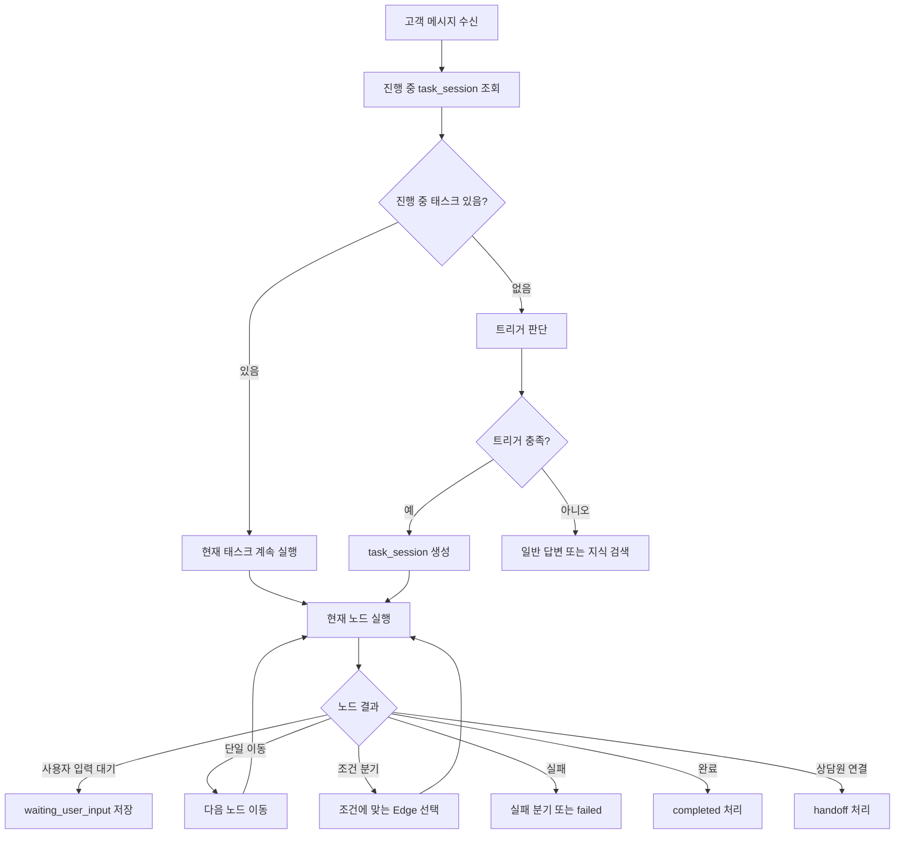
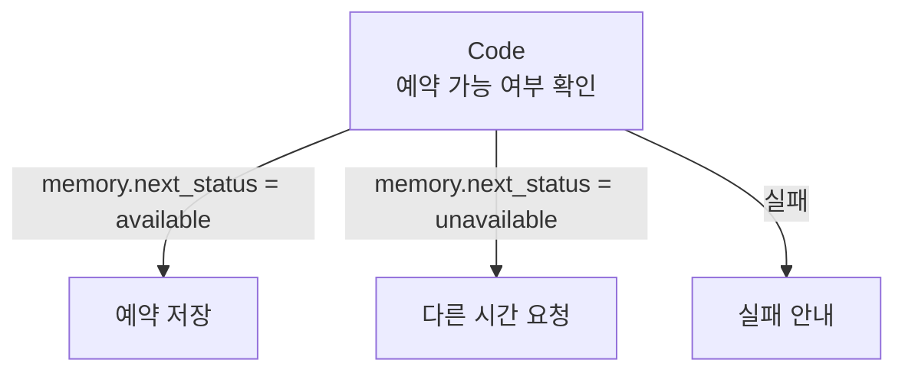

# Front Agent 태스크 기능 개발 문서

## Dynamic Task Flow Builder & Runtime

---

## 1. 개요

Front Agent의 태스크 기능은 고객 문의를 실제 업무 처리 흐름으로 연결하는 자동화 시스템이다.

관리자는 태스크 빌더를 통해 업무 흐름을 다이어그램으로 구성할 수 있으며, 고객 메시지가 특정 트리거 조건을 만족하면 해당 태스크가 실행된다.

태스크는 고객에게 질문하고, 값을 수집하고, 메모리에 저장하며, 조건에 따라 분기하고, 함수 또는 코드를 실행하고, 최종 완료 상태에 도달할 때까지 진행된다.

예시 태스크:

```
- 예약 생성
- 예약 조회
- 예약 취소
- 예약 변경
- 환불 요청
- 주문 상태 조회
- 고객 정보 수집
- 상담원 연결
```

---

## 2. 핵심 목표

태스크 기능의 목표는 다음과 같다.

```
1. 사용자가 직접 업무 플로우를 다이어그램으로 구성한다.
2. 고객 메시지가 트리거 조건을 만족하면 태스크가 시작된다.
3. 태스크가 시작되면 완료 전까지 해당 태스크 상태를 유지한다.
4. 태스크 안에서 메시지, 질문, 지시문, 조건 분기, 함수 실행, 코드 실행이 가능하다.
5. 태스크 중 수집한 값은 memory에 저장하고 이후 노드에서 재사용한다.
6. 노드 간 이동은 단일 이동, 조건 분기, 실패 분기, 완료로 구성한다.
7. UI에서는 각 노드 안에서 다음 이동/분기를 설정하는 것처럼 제공한다.
8. DB에서는 노드와 엣지를 분리하여 저장한다.
9. 태스크 실행 로그, 테스트, 디버깅 기능을 제공한다.
```

---

## 3. 핵심 개념

### 3.1 Task Flow

하나의 업무 자동화 플로우이다.

예시:

```
예약 생성 플로우
```

구성 예시:

```
Trigger
→ Instruction
→ Ask
→ Function
→ Condition
→ Message
→ End
```

---

### 3.2 Trigger

태스크가 언제 시작될지 정의하는 시작 조건이다.

예시:

```
고객이 예약을 원할 때
고객이 주문 상태를 물어볼 때
고객이 환불을 요청할 때
고객이 상담원 연결을 요청할 때
```

Trigger는 다이어그램에서 시각적으로는 노드처럼 보일 수 있지만, 실제 실행 기준은 `task_flows`의 속성으로 관리한다.

```json
{
  "trigger_description": "고객이 새 예약을 원할 때 실행",
  "trigger_examples": [
    "예약하고 싶어요",
    "내일 3시에 가능해요?",
    "방문 예약 잡아주세요"
  ]
}
```

---

### 3.3 Node

노드는 태스크 안에서 수행할 작업 단위이다.

즉, 노드는 **무엇을 할지**를 정의한다.

예시:

```
- 고객에게 메시지 보내기
- 고객에게 질문하기
- LLM에게 정보 추출 지시하기
- 예약 가능 여부 확인 함수 실행하기
- JavaScript 코드 실행하기
- 조건 판단하기
- 상담원 연결하기
- 태스크 완료하기
```

---

### 3.4 Edge

엣지는 노드 간 이동 경로이다.

즉, 엣지는 **다음에 어디로 갈지**를 정의한다.

예시:

```
Ask Date 다음에는 Ask Time으로 이동
예약 가능하면 Save Reservation으로 이동
예약 불가능하면 Ask Other Time으로 이동
코드 실행 실패 시 Fail Message로 이동
```

---

### 3.5 Memory

Memory는 태스크 실행 중 노드 간 데이터를 저장하고 전달하는 임시 저장소이다.

저장 위치:

```
task_sessions.variables
```

예시:

```json
{
  "customer_name": "김민수",
  "reservation_date": "내일",
  "reservation_time": "오후 3시",
  "normalized_date": "2026-06-22",
  "normalized_time": "15:00",
  "is_available": true
}
```

---

### 3.6 Task Session

고객별 태스크 진행 상태이다.

예시:

```json
{
  "session_id": "chat_123",
  "flow_id": "reservation_create_flow",
  "current_node_key": "ask_time",
  "status": "waiting_user_input",
  "variables": {
    "reservation_date": "내일"
  }
}
```

---

## 4. 태스크 실행 원칙

### 4.1 진행 중 태스크 우선

고객 메시지를 받으면 먼저 진행 중인 태스크가 있는지 확인한다.

진행 중인 태스크가 있으면 고객의 메시지는 새로운 intent로 판단하지 않고, 현재 태스크의 현재 노드 입력으로 처리한다.

```
고객 메시지 수신
→ 진행 중 task_session 조회
→ 진행 중 태스크 있음
→ 현재 노드에 고객 입력 전달
→ memory 업데이트
→ 다음 노드 이동
```

진행 중 태스크가 없을 때만 새로운 트리거 판단을 수행한다.

```
고객 메시지 수신
→ 진행 중 task_session 없음
→ 트리거 판단
→ 태스크 시작 또는 일반/지식 응답
```

---

### 4.2 태스크는 완료 전까지 유지

태스크에 진입하면 다음 상태 중 하나가 되기 전까지 태스크 안에 머문다.

```
- completed
- cancelled
- handoff
- failed
- expired
```

---

### 4.3 예외 명령

진행 중 태스크가 있어도 다음과 같은 전역 명령은 우선 처리한다.

```
- 취소할게요
- 처음부터 다시 할게요
- 상담원 연결해줘
- 그만할게요
- 다른 질문 할게요
```

이 처리는 `global_command_node`에서 수행한다.

---

## 5. 태스크 실행 흐름



---

## 6. 노드 타입

### 6.1 Message Node

고객에게 메시지를 출력하는 노드이다.

Config 예시:

```json
{
  "message": "{{memory.customer_name}}님, 예약 가능 여부를 확인해드릴게요."
}
```

---

### 6.2 Ask Node

고객에게 질문하고 답변을 memory에 저장하는 노드이다.

Config 예시:

```json
{
  "question": "원하시는 예약 날짜가 언제인가요?",
  "variable_name": "reservation_date"
}
```

동작 예시:

```
AI: 원하시는 예약 날짜가 언제인가요?
고객: 내일이요
→ memory.reservation_date = "내일이요"
```

---

### 6.3 Instruction Node

LLM에게 추출, 판단, 요약, 응답 생성 등을 지시하는 노드이다.

Config 예시:

```json
{
  "instruction": "사용자 메시지에서 예약 날짜, 시간, 인원수를 추출해라. 없으면 null로 둬라.",
  "output_schema": {
    "reservation_date": "string | null",
    "reservation_time": "string | null",
    "party_size": "number | null"
  },
  "save_to_memory": true
}
```

결과 예시:

```json
{
  "reservation_date": "내일",
  "reservation_time": "오후 3시",
  "party_size": 2
}
```

---

### 6.4 Function Node

미리 정의된 내부 함수 또는 API를 선택해서 실행하는 노드이다.

Function Node는 일반 관리자도 쉽게 사용할 수 있도록 폼 기반 UI로 제공한다.

역할:

```
- 예약 가능 여부 확인
- 예약 저장
- 예약 조회
- 고객 조회
- 문자 발송
- 주문 조회
- 환불 가능 여부 확인
```

Config 예시:

```json
{
  "function_name": "check_reservation_availability",
  "params": {
    "date": "{{memory.normalized_date}}",
    "time": "{{memory.normalized_time}}"
  },
  "save_as": "availability_result"
}
```

실행 결과는 memory에 저장한다.

```json
{
  "availability_result": {
    "available": true,
    "slots": ["15:00", "16:00"]
  },
  "is_available": true
}
```

---

### 6.5 Code Node

JavaScript 코드를 직접 작성해서 실행하는 노드이다.

Code Node는 고급 사용자 또는 개발자용 기능이다.

역할:

```
- memory 값 읽기/쓰기
- 데이터 정규화
- 복잡한 조건 계산
- 외부 API 호출
- 내부 시스템 조회/갱신
- Function Node로 제공되지 않는 커스텀 처리
```

Code Node는 반드시 sandbox 환경에서 실행한다.

---

### 6.6 Condition Node

memory 값을 기준으로 조건을 판단하는 노드이다.

다만 권장 구조에서는 Condition Node를 별도로 둘 수도 있고, 각 노드의 “다음 단계 설정” 안에서 조건 분기를 설정할 수도 있다.

Config 예시:

```json
{
  "variable": "memory.is_available",
  "operator": "equals",
  "value": true
}
```

---

### 6.7 Human Approval Node

상담사 승인을 기다리는 노드이다.

예시:

```
- 환불 승인
- 예약 확정 승인
- 고액 결제 승인
- 민감한 응대 승인
```

상태:

```
task_session.status = approval_waiting
```

---

### 6.8 Handoff Node

상담원에게 연결하는 노드이다.

예시 조건:

```
- 고객이 상담원 연결 요청
- AI가 처리할 수 없는 요청
- 태스크 실패
- 고객 불만 감지
```

---

### 6.9 End Node

태스크를 종료하는 노드이다.

Config 예시:

```json
{
  "message": "예약 요청이 접수되었습니다. 담당자가 확인 후 안내드리겠습니다.",
  "status": "completed"
}
```

---

## 7. Function Node와 Code Node 역할 분리

Function Node와 Code Node는 모두 실행 결과를 memory에 저장하고 다음 노드로 넘길 수 있다는 점에서 일부 역할이 겹친다.

하지만 제품 설계상 역할을 명확히 나눈다.

---

### 7.1 Function Node

Function Node는 **미리 만들어둔 안전한 기능을 선택해서 실행하는 노드**이다.

대상 사용자:

```
일반 관리자
비개발자
운영자
```

특징:

```
- 코드 작성 필요 없음
- 드롭다운과 폼으로 설정
- 내부에서 검증된 서버 함수 실행
- 보안 위험 낮음
- MVP에서 우선 구현
```

예시:

```
check_reservation_availability
create_reservation
lookup_reservation
cancel_reservation
send_sms
lookup_order
```

---

### 7.2 Code Node

Code Node는 **사용자가 직접 JavaScript로 커스텀 로직을 작성하는 노드**이다.

대상 사용자:

```
개발자
고급 관리자
외부 시스템 연동이 필요한 조직
```

특징:

```
- JavaScript 직접 작성
- 자유도 높음
- 외부 API 호출 가능
- 복잡한 데이터 가공 가능
- sandbox 필수
- 테스트/로그/Diff 기능 필요
```

---

### 7.3 역할 비교

| 구분         | Function Node         | Code Node          |
| ------------ | --------------------- | ------------------ |
| 목적         | 안전한 기능 선택 실행 | 커스텀 JS 실행     |
| 사용자       | 일반 관리자           | 개발자/고급 사용자 |
| UI           | 드롭다운/폼           | 코드 에디터        |
| 자유도       | 낮음~중간             | 높음               |
| 안정성       | 높음                  | 낮음               |
| 보안 위험    | 낮음                  | 높음               |
| Sandbox      | 불필요 또는 낮음      | 필수               |
| MVP 우선순위 | 1차                   | 3차                |
| 예시         | 예약 가능 확인        | 외부 API 직접 호출 |

---

### 7.4 최종 정의

```
Function Node = 안전한 버튼형 자동화
Code Node = 자유로운 개발자형 자동화
```

---

## 8. Code Node 상세 설계

### 8.1 제공 객체

Code Node에는 다음 객체를 제공한다.

```
context
memory
isSandbox
```

---

### 8.2 context

`context`는 실행 시점의 읽기 전용 정보이다.

포함 정보:

```
- organization
- user
- userChat
- currentMessage
- task
- node
```

예시:

```json
{
  "organization": {
    "id": "org_123",
    "name": "테스트 병원"
  },
  "user": {
    "id": "customer_123",
    "name": "김민수",
    "phone": "010-1234-5678"
  },
  "userChat": {
    "id": "chat_123",
    "sessionId": "session_123",
    "channel": "chat"
  },
  "currentMessage": {
    "text": "내일 오후 3시에 예약하고 싶어요"
  }
}
```

원칙:

```
context는 읽기 전용이다.
context 값을 수정해도 실제 데이터에는 반영되지 않는다.
```

---

### 8.3 memory

`memory`는 태스크 실행 중 데이터를 저장하는 인터페이스이다.

제공 메서드:

```tsx
memory.get(key: string): any
memory.put(key: string, value: any): void
memory.save(): Promise<void>
```

원칙:

```
memory.get() = 값 읽기
memory.put() = 변경 예정 값 등록
memory.save() = 실제 저장
```

중요:

```
memory.put()만 호출하면 실제 저장되지 않는다.
반드시 await memory.save()를 호출해야 task_sessions.variables에 반영된다.
```

---

### 8.4 isSandbox

`isSandbox`는 테스트 실행인지 실제 실행인지 구분하는 값이다.

```
isSandbox = true
- 관리자 테스트 실행
- 외부 API 호출 차단 또는 mock 사용
- 실제 고객 데이터에 영향 없음

isSandbox = false
- 실제 고객 상담 실행
- 허용된 API 호출 가능
- 실제 task_session memory 저장
```

---

### 8.5 Code Node 기본 형태

```jsx
async function main({ context, memory, isSandbox }) {
  const date = memory.get("reservation_date");

  memory.put("checked_date", date);

  await memory.save();

  return {
    ok: true,
  };
}
```

---

### 8.6 Code Node 예시: 상태값 계산

Code Node 안의 if문은 다음 노드를 직접 정하기보다, 이동 판단에 사용할 상태값을 memory에 저장하는 용도로 사용한다.

```jsx
async function main({ memory }) {
  const stock = memory.get("stock");

  if (stock > 0) {
    memory.put("stock_status", "available");
  } else {
    memory.put("stock_status", "sold_out");
  }

  await memory.save();

  return {
    stock_status: memory.get("stock_status"),
  };
}
```

이후 Edge 조건에서 다음 노드를 결정한다.

```
memory.stock_status == "available" → 결제 안내 노드
memory.stock_status == "sold_out" → 품절 안내 노드
```

---

### 8.7 Code Node 예시: 예약 가능 여부 API 호출

```jsx
async function main({ context, memory, isSandbox }) {
  const axios = require("axios");

  const date = memory.get("normalized_date");
  const time = memory.get("normalized_time");

  if (isSandbox) {
    memory.put("availability_result", {
      available: true,
      source: "mock",
    });
    memory.put("is_available", true);

    await memory.save();
    return;
  }

  const response = await axios.post(
    "<https://api.example.com/reservations/check>",
    {
      date,
      time,
      customerId: context.user.id,
    },
  );

  memory.put("availability_result", response.data);
  memory.put("is_available", response.data.available);

  await memory.save();

  return {
    available: response.data.available,
  };
}
```

---

## 9. Code Node 보안 원칙

사용자 작성 JavaScript는 반드시 sandbox 환경에서 실행한다.

금지 사항:

```
- 서버에서 직접 eval 실행 금지
- 파일 시스템 접근 금지
- process 접근 금지
- 환경변수 직접 접근 금지
- 임의 패키지 import 금지
- 무한루프 방지
- 무제한 네트워크 요청 금지
```

필수 제한:

```
- 실행 시간 제한
- 메모리 사용량 제한
- 허용 라이브러리 제한
- 허용 도메인 allowlist
- 조직별 secrets 분리
- console.log 수집
- 실행 결과 로그 저장
- 실패 시 failure edge 처리
```

초기 권장 설정:

```
language: javascript
timeout_seconds: 10
max_memory_mb: 128
allowed_libraries: ["axios"]
sandbox_network_enabled: false
production_network_enabled: true
```

---

## 10. Edge와 분기 설계

### 10.1 기본 원칙

Node는 작업을 수행하고, Edge는 다음 이동을 결정한다.

```
Node = 무엇을 할지
Edge = 다음에 어디로 갈지
```

---

### 10.2 UI와 DB의 차이

사용자 경험상 분기는 노드 안에서 설정하는 것처럼 보여주는 것이 좋다.

하지만 DB에서는 엣지를 별도 테이블로 저장한다.

```
UI 관점:
노드 설정 패널 안에서 다음 이동/조건 분기/실패 분기 설정

DB 관점:
task_edges 테이블에 source, target, condition 저장
```

---

### 10.3 노드 설정 패널 예시

```
[다음 단계 설정]

이동 방식:
(o) 단일 이동
( ) 조건 분기
( ) 완료

다음 단계:
[예약 가능 여부 확인 ▼]
```

조건 분기 설정:

```
[다음 단계 설정]

이동 방식:
( ) 단일 이동
(o) 조건 분기
( ) 완료

조건 1:
memory.is_available == true
→ 예약 저장

조건 2:
memory.is_available == false
→ 다른 시간 요청

기본 이동:
→ 상담원 연결
```

실패 분기 설정:

```
[실패 시 이동]

(o) 실패 분기 사용

실패하면:
→ 오류 안내 메시지
```

---

### 10.4 단일 이동 Edge

```json
{
  "source_node_key": "ask_date",
  "target_node_key": "ask_time",
  "condition_type": "always"
}
```

---

### 10.5 조건 분기 Edge

```json
{
  "source_node_key": "check_available",
  "target_node_key": "save_reservation",
  "condition_type": "equals",
  "condition_config": {
    "variable": "memory.is_available",
    "value": true
  },
  "is_failure_edge": false
}
```

```json
{
  "source_node_key": "check_available",
  "target_node_key": "ask_other_time",
  "condition_type": "equals",
  "condition_config": {
    "variable": "memory.is_available",
    "value": false
  },
  "is_failure_edge": false
}
```

---

### 10.6 실패 분기 Edge

Code Node, Function Node, API Node 실행 실패 시 이동할 경로이다.

```json
{
  "source_node_key": "check_available",
  "target_node_key": "fail_message",
  "condition_type": "request_failed",
  "condition_config": {},
  "is_failure_edge": true
}
```

실패 분기가 없으면 태스크는 `failed` 상태로 종료된다.

---

## 11. if문과 Edge 조건의 역할 분리

### 11.1 Code 안 if문

Code Node 안의 if문은 데이터 계산, 값 변환, 상태값 저장에 사용한다.

예시:

```jsx
async function main({ memory }) {
  const amount = memory.get("refund_amount");

  if (amount > 100000) {
    memory.put("approval_required", true);
  } else {
    memory.put("approval_required", false);
  }

  await memory.save();
}
```

---

### 11.2 Edge 조건

Edge 조건은 실제 플로우 이동에 사용한다.

예시:

```
memory.approval_required == true → Human Approval Node
memory.approval_required == false → Refund Process Node
```

---

### 11.3 권장 구조

```
Code Node if문 = 데이터 계산/상태 저장
Edge 조건 = 실제 다음 노드 이동
```

---

### 11.4 비권장 구조

Code Node 안에서 직접 다음 노드를 return하는 방식은 권장하지 않는다.

비권장 예시:

```jsx
async function main({ memory }) {
  const available = memory.get("is_available");

  if (available) {
    return {
      next_node: "save_reservation",
    };
  }

  return {
    next_node: "ask_other_time",
  };
}
```

비권장 이유:

```
- 다이어그램에서 분기가 보이지 않는다.
- 운영자가 흐름을 이해하기 어렵다.
- 디버깅이 어렵다.
- React Flow와 연결이 약해진다.
- 노드 간 연결 정보가 코드 안에 숨는다.
```

---

### 11.5 권장 구조

권장 방식:

```
Code Node:
memory.next_status = "available" 저장

Edge:
memory.next_status == "available" → 예약 저장
memory.next_status == "unavailable" → 다른 시간 요청
```

다이어그램 예시:



---

## 12. Dynamic Task Runner

Dynamic Task Runner는 DB에 저장된 태스크 플로우를 실제로 실행하는 엔진이다.

역할:

```
- task_session 조회
- task_flow 로드
- 현재 node 로드
- node_type에 맞는 executor 실행
- memory 업데이트
- edge 평가
- 다음 node 이동
- waiting/completed/failed 상태 저장
```

---

### 12.1 실행 로직

```
1. 고객 메시지 수신
2. 진행 중 task_session 조회
3. 있으면 현재 노드에 사용자 입력 전달
4. 없으면 decision_node에서 flow_id 결정
5. flow_id 기준 task_flow, task_nodes, task_edges 로드
6. task_session 생성
7. 현재 노드 실행
8. 노드 결과에 따라 처리
   - wait_user
   - go_next
   - branch
   - complete
   - fail
   - handoff
9. task_session 상태 업데이트
10. 응답 반환
```

---

### 12.2 Executor 구조

노드 타입별로 executor를 분리한다.

```
executors/
  ask_executor.py
  message_executor.py
  instruction_executor.py
  function_executor.py
  code_executor.py
  condition_executor.py
  human_approval_executor.py
  handoff_executor.py
  end_executor.py
```

---

### 12.3 Node 실행 결과 표준화

모든 executor는 공통 결과 형식을 반환한다.

```json
{
  "status": "success",
  "message": "예약 가능 여부를 확인했습니다.",
  "memory_updates": {
    "is_available": true
  },
  "next_behavior": "evaluate_edges",
  "error": null
}
```

가능한 `next_behavior`:

```
evaluate_edges
wait_user
complete
fail
handoff
```

---

## 13. DB 설계

### 13.1 task_flows

```sql
create table task_flows (
  id uuid primary key default gen_random_uuid(),
  organization_id uuid references organizations(id) on delete cascade,

  name text not null,
  description text,

  trigger_intent text,
  trigger_description text,
  trigger_examples jsonb default '[]'::jsonb,

  allowed_channels jsonb default '["chat", "voice"]'::jsonb,
  filters jsonb default '{}'::jsonb,

  is_enabled boolean default true,

  created_at timestamptz default now(),
  updated_at timestamptz default now()
);
```

---

### 13.2 task_nodes

```sql
create table task_nodes (
  id uuid primary key default gen_random_uuid(),
  flow_id uuid references task_flows(id) on delete cascade,

  node_key text not null,
  node_type text not null,
  label text not null,

  config jsonb default '{}'::jsonb,
  code text,

  position_x int default 0,
  position_y int default 0,

  timeout_seconds int default 10,
  retry_limit int default 0,

  created_at timestamptz default now(),
  updated_at timestamptz default now(),

  unique(flow_id, node_key)
);
```

---

### 13.3 task_edges

```sql
create table task_edges (
  id uuid primary key default gen_random_uuid(),
  flow_id uuid references task_flows(id) on delete cascade,

  source_node_key text not null,
  target_node_key text not null,

  edge_type text default 'single',
  condition_type text default 'always',
  condition_config jsonb default '{}'::jsonb,

  is_failure_edge boolean default false,
  priority int default 100,

  created_at timestamptz default now()
);
```

---

### 13.4 task_sessions

```sql
create table task_sessions (
  id uuid primary key default gen_random_uuid(),

  organization_id uuid references organizations(id) on delete cascade,
  session_id text not null,
  flow_id uuid references task_flows(id) on delete cascade,

  current_node_key text not null,
  waiting_node_key text,

  variables jsonb default '{}'::jsonb,

  status text default 'running',
  approval_status text,
  last_error jsonb,
  expires_at timestamptz,

  created_at timestamptz default now(),
  updated_at timestamptz default now(),

  unique(organization_id, session_id, flow_id)
);
```

---

### 13.5 task_node_execution_logs

```sql
create table task_node_execution_logs (
  id uuid primary key default gen_random_uuid(),

  organization_id uuid not null,
  task_session_id uuid,
  flow_id uuid,
  node_id uuid,

  node_type text not null,
  status text not null,

  input_snapshot jsonb,
  output_snapshot jsonb,

  memory_before jsonb,
  memory_after jsonb,
  memory_diff jsonb,

  console_logs jsonb default '[]'::jsonb,
  error jsonb,

  duration_ms int,
  is_sandbox boolean default false,

  created_at timestamptz default now()
);
```

---

## 14. 관리자 화면 요구사항

### 14.1 태스크 목록

기능:

```
- 태스크 목록 조회
- 태스크 생성
- 태스크 수정
- 태스크 삭제
- 활성/비활성
- 최근 실행 횟수 확인
- 실패 로그 확인
```

---

### 14.2 태스크 빌더

React Flow 기반 다이어그램 편집 화면이다.

기능:

```
- 노드 추가
- 노드 삭제
- 노드 이동
- 노드 연결
- 단일 이동 설정
- 조건 분기 설정
- 실패 분기 설정
- 노드별 Config 수정
- 저장
- 테스트 실행
```

---

### 14.3 노드 설정 패널

노드를 클릭하면 오른쪽 패널에서 설정한다.

공통 설정:

```
- 노드 이름
- 노드 타입
- 설명
- Config
- timeout
- retry
- 다음 단계 설정
- 조건 분기 설정
- 실패 시 이동 노드
```

---

### 14.4 Function Node 설정 화면

```
- 함수 선택
- 입력 파라미터 매핑
- 결과 저장 변수명
- 성공 시 다음 단계
- 실패 시 다음 단계
- 테스트 실행
```

예시:

```
함수: 예약 가능 여부 확인
date: {{memory.normalized_date}}
time: {{memory.normalized_time}}
save_as: availability_result
```

---

### 14.5 Code Node 설정 화면

```
왼쪽:
- JavaScript 코드 에디터

오른쪽:
- context sample JSON
- memory sample JSON
- isSandbox 설정

하단:
- 테스트 실행 버튼
- Result In
- Result Out
- Memory Diff
- Console Log
- Error Stack

다음 단계:
- 단일 이동
- 조건 분기
- 실패 분기
```

---

## 15. API 설계

### 15.1 태스크 플로우 API

```
POST /task-flows
GET /task-flows
GET /task-flows/{flow_id}
PATCH /task-flows/{flow_id}
DELETE /task-flows/{flow_id}
```

---

### 15.2 태스크 노드 API

```
POST /task-flows/{flow_id}/nodes
PATCH /task-flows/{flow_id}/nodes/{node_id}
DELETE /task-flows/{flow_id}/nodes/{node_id}
```

---

### 15.3 태스크 Edge API

```
POST /task-flows/{flow_id}/edges
PATCH /task-flows/{flow_id}/edges/{edge_id}
DELETE /task-flows/{flow_id}/edges/{edge_id}
```

실제 UI에서는 노드 설정 패널에서 다음 단계를 설정하지만, 서버 저장은 edge API로 처리한다.

---

### 15.4 태스크 테스트 API

```
POST /task-flows/{flow_id}/test
POST /task-flows/{flow_id}/nodes/{node_id}/test
```

---

### 15.5 Code Node 테스트 API

```
POST /task-flows/{flow_id}/nodes/{node_id}/test-code
```

Request:

```json
{
  "context": {
    "user": {
      "id": "customer_123",
      "name": "김민수"
    },
    "userChat": {
      "id": "chat_123",
      "channel": "chat"
    },
    "currentMessage": {
      "text": "내일 오후 3시에 예약하고 싶어요"
    }
  },
  "memory": {
    "reservation_date": "내일",
    "reservation_time": "오후 3시"
  },
  "isSandbox": true
}
```

Response:

```json
{
  "status": "success",
  "duration_ms": 123,
  "memory_before": {
    "reservation_date": "내일",
    "reservation_time": "오후 3시"
  },
  "memory_after": {
    "reservation_date": "내일",
    "reservation_time": "오후 3시",
    "normalized_date": "2026-06-22",
    "normalized_time": "15:00"
  },
  "memory_diff": {
    "added": {
      "normalized_date": "2026-06-22",
      "normalized_time": "15:00"
    },
    "changed": {},
    "removed": {}
  },
  "console_logs": [],
  "error": null
}
```

---

## 16. MVP 범위

### 16.1 1차 MVP

목표: DB 기반 태스크 실행

포함 기능:

```
- task_flows/nodes/edges/sessions DB 구현
- 태스크 수동 등록
- Dynamic Task Runner 구현
- Message Node
- Ask Node
- Instruction Node
- Condition 분기
- Function Node
- End Node
- task_session 상태 유지
- memory 저장/호출
```

---

### 16.2 2차 MVP

목표: 관리자 빌더 구현

포함 기능:

```
- React Flow 태스크 빌더
- 노드 추가/수정/삭제
- Edge 연결
- 노드 설정 패널
- 다음 단계 설정
- 조건 분기 설정
- 실패 분기 설정
- 태스크 테스트 실행
- 실행 로그 확인
```

---

### 16.3 3차 MVP

목표: Code Node 구현

포함 기능:

```
- JavaScript Code Node
- context 제공
- memory.get/put/save 제공
- isSandbox 제공
- Sandbox 실행 환경
- console.log 수집
- Memory Diff 표시
- Code Node 테스트 API
- 실패 분기 처리
```

---

## 17. 개발 우선순위

```
1. task_flows / task_nodes / task_edges / task_sessions 스키마 생성 (완료)
2. Dynamic Task Runner 기본 구조 구현 (완료)
3. Message / Ask / Instruction / End Node executor 구현 (완료)
4. Edge 평가 로직 구현 (완료)
5. Condition 분기 처리 구현 (완료)
6. Function Node executor 구현 (완료)
7. 예약 생성 플로우를 DB에 수동 등록해 테스트 (완료)

8. task_session 상태 유지 테스트 (완료)
9. memory template 렌더링 보강 (완료)
10. 실패 분기 처리 보강 (완료)

10.5. 태스크 관리 CRUD API 구현
  - 15.1 task_flows API (완료)
  - 15.2 task_nodes API (완료)
  - 15.3 task_edges API

11. React Flow 태스크 빌더 구현
```

[](https://app.notion.com/p/387d7dd91b86804ca754cb00789cf2f8?pvs=21)

---

## 18. 핵심 설계 결정

### 18.1 Function Node와 Code Node는 분리한다

```
Function Node = 안전한 버튼형 자동화
Code Node = 자유로운 개발자형 자동화
```

기능적으로 겹칠 수 있지만, 사용자 대상과 안정성 수준이 다르기 때문에 별도 노드로 제공한다.

---

### 18.2 Node와 Edge는 역할을 분리한다

```
Node = 작업 실행
Edge = 다음 이동 결정
```

---

### 18.3 UI에서는 노드 안에서 분기 설정처럼 제공한다

사용자는 노드 설정 패널에서 “성공 시 이동”, “조건 분기”, “실패 시 이동”을 설정한다.

하지만 실제 저장은 `task_edges`에 한다.

```
UI = 노드 중심 설정
DB = 노드/엣지 분리 저장
```

---

### 18.4 Code 안 if문은 값 계산용이다

Code Node 안의 if문은 memory에 상태값을 저장하는 용도로 사용한다.

```
Code if문 = 값 계산
Edge 조건 = 실제 이동
```

---

### 18.5 Code에서 next_node를 직접 return하지 않는다

다음 노드를 코드 안에 숨기지 않는다.

비권장:

```
return { next_node: "save_reservation" }
```

권장:

```
memory.next_status = "available"
Edge 조건으로 save_reservation 이동
```

---

### 18.6 진행 중 태스크는 완료 전까지 유지한다

진행 중 task_session이 있으면 고객의 다음 메시지는 현재 태스크의 입력으로 처리한다.

---

### 18.7 Code Node는 Sandbox 필수이다

사용자 작성 JS는 서버에서 직접 실행하지 않는다.

---

## 19. 최종 요약

Front Agent의 태스크 기능은 사용자가 직접 업무 자동화 플로우를 구성하고, 고객 메시지에 따라 실행되는 Dynamic Task System이다.

핵심 구성:

```
Task Flow = 하나의 업무 플로우
Trigger = 시작 조건
Node = 실행 단계
Edge = 이동 경로
Memory = 태스크 내 변수 저장소
Task Session = 고객별 진행 상태
Dynamic Task Runner = 태스크 실행 엔진
```

Function Node와 Code Node는 다음 기준으로 구분한다.

```
Function Node = 미리 정의된 안전한 기능 실행
Code Node = JavaScript로 직접 커스텀 로직 실행
```

노드와 엣지는 다음 기준으로 구분한다.

```
Node = 무엇을 할지
Edge = 어디로 갈지
```

UI에서는 채널톡처럼 노드 안에서 다음 단계와 분기를 설정하는 경험을 제공하지만, DB에서는 `task_nodes`와 `task_edges`를 분리하여 저장한다.

Code Node의 if문은 상태값을 계산해 memory에 저장하는 데 사용하고, 실제 플로우 이동은 Edge 조건으로 처리한다.

이를 통해 태스크 흐름이 다이어그램에서 명확히 보이고, 운영자가 쉽게 수정하고 디버깅할 수 있는 AI 업무 자동화 시스템을 구현한다.
